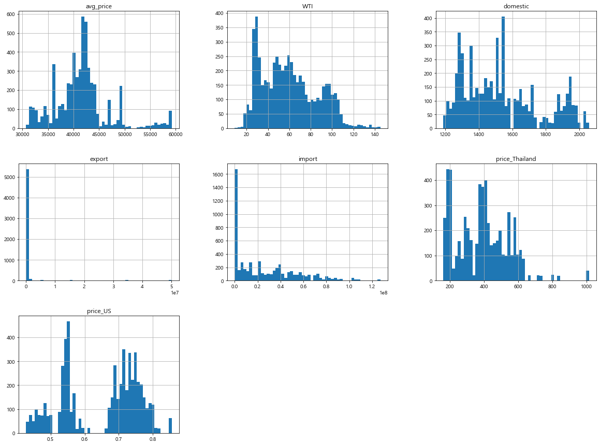
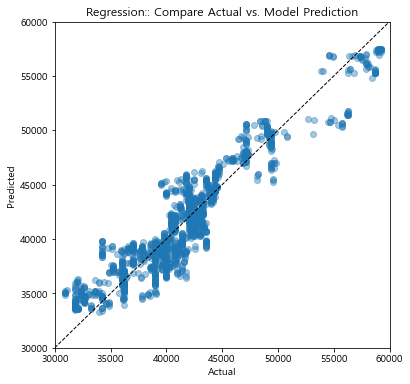
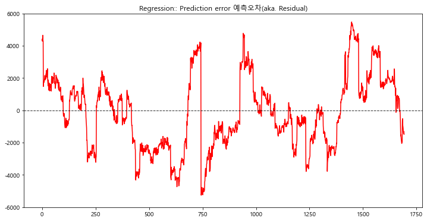
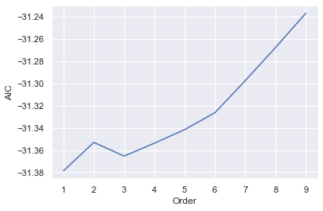

# 농산물 가격 예측 모형

## 박지헌

## 0. 라이브러리 & 데이터프레임 전처리

```python
import numpy as np
import pandas as pd
import datetime
import seaborn as sns
import matplotlib.pyplot as plt
plt.rcParams['axes.unicode_minus'] = False
from matplotlib import font_manager, rc
font_name = font_manager.FontProperties(fname="c:/Windows/Fonts/malgun.ttf").get_name()
rc('font', family=font_name)
%matplotlib inline
from fbprophet import Prophet
from statsmodels.stats.outliers_influence import variance_inflation_factor
from matplotlib import pyplot
import statsmodels.api as sm
from sklearn.model_selection import train_test_split
from statsmodels.stats.outliers_influence import variance_inflation_factor
from sklearn.preprocessing import MinMaxScaler
from sklearn.preprocessing import QuantileTransformer
from sklearn import metrics  # 나머지는 sklearn에서 활용
from sklearn.metrics import r2_score, mean_squared_error,mean_absolute_error,mean_squared_log_error
import eli5
from eli5.sklearn import PermutationImportance
# pd.set_option('mode.chained_assignment',  None)
from sklearn import tree
from sklearn.ensemble import RandomForestRegressor
```

```python
df = pd.read_csv('data/rice_weather3.csv')
df['date']=pd.to_datetime(df['date'])
```

### 0.1 결측값 확인

```python
# pd.set_option("max_rows", None)
fig = plt.figure(figsize=(10, 4))
df.isnull().sum().plot(kind='bar')
```

    <AxesSubplot:>


```python
df['WTI'].interpolate(method='linear',limit_direction='forward',inplace=True)
df.dropna(inplace=True)

# pd.set_option("max_rows", None)
fig = plt.figure(figsize=(10, 4))
df.isnull().sum().plot(kind='bar')
```

    <AxesSubplot:>


### 0.2 이상값 확인

```python
df.plot(kind='scatter',x='date', y='WTI')
```

    <AxesSubplot:xlabel='date', ylabel='WTI'>


```python
cond = (df["WTI"] < 0)
df[cond]

df.drop(6392,inplace=True)
df.plot(kind='scatter',x='date', y='WTI')
```

    <AxesSubplot:xlabel='date', ylabel='WTI'>


```python
# df.to_csv("data/rice_df.csv",index=False)
```

```python
df=pd.read_csv("data/rice_df2.csv")
df['date']=pd.to_datetime(df['date'])
df
```

<div>
<style scoped>
    .dataframe tbody tr th:only-of-type {
        vertical-align: middle;
    }

    .dataframe tbody tr th {
        vertical-align: top;
    }

    .dataframe thead th {
        text-align: right;
    }

</style>
<table border="1" class="dataframe">
  <thead>
    <tr style="text-align: right;">
      <th></th>
      <th>date</th>
      <th>avg_price</th>
      <th>consumption</th>
      <th>CPI</th>
      <th>consumer_price_growth_rate</th>
      <th>food_non_alcoholic_beverages</th>
      <th>Liquor_tobacco</th>
      <th>clothes_shoes</th>
      <th>housing_water_electricity_fuel</th>
      <th>household_goods_housekeeping_services</th>
      <th>...</th>
      <th>export</th>
      <th>import</th>
      <th>price_Thailand</th>
      <th>price_US</th>
      <th>temperature</th>
      <th>precipitation</th>
      <th>wind_speed</th>
      <th>relative_humidity</th>
      <th>total_insolation</th>
      <th>maximum_snow_depth</th>
    </tr>
  </thead>
  <tbody>
    <tr>
      <th>0</th>
      <td>2000-01-03</td>
      <td>41900</td>
      <td>93.600</td>
      <td>66.6</td>
      <td>2.3</td>
      <td>0.8</td>
      <td>0.8</td>
      <td>1.5</td>
      <td>3.7</td>
      <td>-2.5</td>
      <td>...</td>
      <td>0</td>
      <td>43034642</td>
      <td>247.500000</td>
      <td>0.499000</td>
      <td>0.692857</td>
      <td>0.000000</td>
      <td>2.100000</td>
      <td>56.707143</td>
      <td>4.188571</td>
      <td>0.000000</td>
    </tr>
    <tr>
      <th>1</th>
      <td>2000-01-04</td>
      <td>41900</td>
      <td>93.600</td>
      <td>66.6</td>
      <td>2.3</td>
      <td>0.8</td>
      <td>0.8</td>
      <td>1.5</td>
      <td>3.7</td>
      <td>-2.5</td>
      <td>...</td>
      <td>0</td>
      <td>43034642</td>
      <td>247.500000</td>
      <td>0.499000</td>
      <td>1.428571</td>
      <td>0.000000</td>
      <td>1.271429</td>
      <td>56.035714</td>
      <td>3.552143</td>
      <td>0.000000</td>
    </tr>
    <tr>
      <th>2</th>
      <td>2000-01-05</td>
      <td>41800</td>
      <td>93.600</td>
      <td>66.6</td>
      <td>2.3</td>
      <td>0.8</td>
      <td>0.8</td>
      <td>1.5</td>
      <td>3.7</td>
      <td>-2.5</td>
      <td>...</td>
      <td>0</td>
      <td>43034642</td>
      <td>247.500000</td>
      <td>0.499000</td>
      <td>5.642857</td>
      <td>10.550000</td>
      <td>2.450000</td>
      <td>75.957143</td>
      <td>1.521429</td>
      <td>1.185714</td>
    </tr>
    <tr>
      <th>3</th>
      <td>2000-01-06</td>
      <td>41800</td>
      <td>93.600</td>
      <td>66.6</td>
      <td>2.3</td>
      <td>0.8</td>
      <td>0.8</td>
      <td>1.5</td>
      <td>3.7</td>
      <td>-2.5</td>
      <td>...</td>
      <td>0</td>
      <td>43034642</td>
      <td>247.500000</td>
      <td>0.499000</td>
      <td>5.171429</td>
      <td>5.421429</td>
      <td>3.078571</td>
      <td>75.964286</td>
      <td>1.362857</td>
      <td>0.428571</td>
    </tr>
    <tr>
      <th>4</th>
      <td>2000-01-07</td>
      <td>41900</td>
      <td>93.600</td>
      <td>66.6</td>
      <td>2.3</td>
      <td>0.8</td>
      <td>0.8</td>
      <td>1.5</td>
      <td>3.7</td>
      <td>-2.5</td>
      <td>...</td>
      <td>0</td>
      <td>43034642</td>
      <td>247.500000</td>
      <td>0.499000</td>
      <td>-3.750000</td>
      <td>0.442857</td>
      <td>2.935714</td>
      <td>56.807143</td>
      <td>3.915000</td>
      <td>1.028571</td>
    </tr>
    <tr>
      <th>...</th>
      <td>...</td>
      <td>...</td>
      <td>...</td>
      <td>...</td>
      <td>...</td>
      <td>...</td>
      <td>...</td>
      <td>...</td>
      <td>...</td>
      <td>...</td>
      <td>...</td>
      <td>...</td>
      <td>...</td>
      <td>...</td>
      <td>...</td>
      <td>...</td>
      <td>...</td>
      <td>...</td>
      <td>...</td>
      <td>...</td>
      <td>...</td>
    </tr>
    <tr>
      <th>5636</th>
      <td>2021-11-05</td>
      <td>54020</td>
      <td>52.609</td>
      <td>105.4</td>
      <td>0.5</td>
      <td>4.4</td>
      <td>0.3</td>
      <td>0.7</td>
      <td>0.5</td>
      <td>0.0</td>
      <td>...</td>
      <td>196359</td>
      <td>36667741</td>
      <td>496.120606</td>
      <td>0.745517</td>
      <td>12.220000</td>
      <td>4.393333</td>
      <td>1.293333</td>
      <td>72.720000</td>
      <td>6.414667</td>
      <td>0.000000</td>
    </tr>
    <tr>
      <th>5637</th>
      <td>2021-11-08</td>
      <td>53880</td>
      <td>52.609</td>
      <td>105.4</td>
      <td>0.5</td>
      <td>4.4</td>
      <td>0.3</td>
      <td>0.7</td>
      <td>0.5</td>
      <td>0.0</td>
      <td>...</td>
      <td>196359</td>
      <td>36667741</td>
      <td>496.120606</td>
      <td>0.745517</td>
      <td>9.786667</td>
      <td>19.986667</td>
      <td>2.686667</td>
      <td>78.246667</td>
      <td>2.232667</td>
      <td>0.000000</td>
    </tr>
    <tr>
      <th>5638</th>
      <td>2021-11-09</td>
      <td>53880</td>
      <td>52.609</td>
      <td>105.4</td>
      <td>0.5</td>
      <td>4.4</td>
      <td>0.3</td>
      <td>0.7</td>
      <td>0.5</td>
      <td>0.0</td>
      <td>...</td>
      <td>196359</td>
      <td>36667741</td>
      <td>496.120606</td>
      <td>0.745517</td>
      <td>7.020000</td>
      <td>1.226667</td>
      <td>2.260000</td>
      <td>72.180000</td>
      <td>4.563333</td>
      <td>0.000000</td>
    </tr>
    <tr>
      <th>5639</th>
      <td>2021-11-10</td>
      <td>53880</td>
      <td>52.609</td>
      <td>105.4</td>
      <td>0.5</td>
      <td>4.4</td>
      <td>0.3</td>
      <td>0.7</td>
      <td>0.5</td>
      <td>0.0</td>
      <td>...</td>
      <td>196359</td>
      <td>36667741</td>
      <td>496.120606</td>
      <td>0.745517</td>
      <td>6.453333</td>
      <td>3.106667</td>
      <td>2.253333</td>
      <td>74.633333</td>
      <td>4.077333</td>
      <td>0.000000</td>
    </tr>
    <tr>
      <th>5640</th>
      <td>2021-11-11</td>
      <td>53880</td>
      <td>52.609</td>
      <td>105.4</td>
      <td>0.5</td>
      <td>4.4</td>
      <td>0.3</td>
      <td>0.7</td>
      <td>0.5</td>
      <td>0.0</td>
      <td>...</td>
      <td>196359</td>
      <td>36667741</td>
      <td>496.120606</td>
      <td>0.745517</td>
      <td>6.480000</td>
      <td>1.766667</td>
      <td>2.213333</td>
      <td>66.660000</td>
      <td>5.422000</td>
      <td>0.000000</td>
    </tr>
  </tbody>
</table>
<p>5641 rows × 31 columns</p>
</div>

## 1. EDA

### 1.2 파트별 상관관계분석

#### 1.2.1 품목별 소비자 물가 지수

```python
# 품목별 소비자 물가지수
consumer_vars = df[['date','avg_price', 'consumption', 'CPI', 'consumer_price_growth_rate',
       'food_non_alcoholic_beverages', 'Liquor_tobacco', 'clothes_shoes',
       'housing_water_electricity_fuel',
       'household_goods_housekeeping_services', 'sanitation', 'traffic',
       'communication', 'entertainment_culture', 'education',
       'food_accommodation', 'other_goods_services']]

consumer_vars

plt.rcParams['figure.figsize']=[12,7] #크기조정 [가로,높이]인치
plt.title("쌀 가격 - 소비자 물가지수 상관계수", fontsize=15)
sns.heatmap(consumer_vars.corr(),annot=True)
```

    C:\Users\82104\anaconda3\lib\site-packages\matplotlib\backends\backend_agg.py:238: RuntimeWarning: Glyph 8722 missing from current font.
      font.set_text(s, 0.0, flags=flags)
    C:\Users\82104\anaconda3\lib\site-packages\matplotlib\backends\backend_agg.py:201: RuntimeWarning: Glyph 8722 missing from current font.
      font.set_text(s, 0, flags=flags)


    <AxesSubplot:title={'center':'쌀 가격 - 소비자 물가지수 상관계수'}>


```python
consumer_vars.hist(bins=50, figsize=(20, 15))
```

    array([[<AxesSubplot:title={'center':'date'}>,
            <AxesSubplot:title={'center':'avg_price'}>,
            <AxesSubplot:title={'center':'consumption'}>,
            <AxesSubplot:title={'center':'CPI'}>],
           [<AxesSubplot:title={'center':'consumer_price_growth_rate'}>,
            <AxesSubplot:title={'center':'food_non_alcoholic_beverages'}>,
            <AxesSubplot:title={'center':'Liquor_tobacco'}>,
            <AxesSubplot:title={'center':'clothes_shoes'}>],
           [<AxesSubplot:title={'center':'housing_water_electricity_fuel'}>,
            <AxesSubplot:title={'center':'household_goods_housekeeping_services'}>,
            <AxesSubplot:title={'center':'sanitation'}>,
            <AxesSubplot:title={'center':'traffic'}>],
           [<AxesSubplot:title={'center':'communication'}>,
            <AxesSubplot:title={'center':'entertainment_culture'}>,
            <AxesSubplot:title={'center':'education'}>,
            <AxesSubplot:title={'center':'food_accommodation'}>],
           [<AxesSubplot:title={'center':'other_goods_services'}>,
            <AxesSubplot:title={'center':'Year'}>, <AxesSubplot:>,
            <AxesSubplot:>]], dtype=object)


```python
consumer_vars['Year'] = df['date'].dt.year;consumer_vars
plt.figure(figsize=(12,8))
sns.pairplot(consumer_vars,
             x_vars=['consumption', 'CPI','consumer_price_growth_rate',
       'food_non_alcoholic_beverages', 'Liquor_tobacco', 'clothes_shoes',
       'housing_water_electricity_fuel',
       'household_goods_housekeeping_services', 'sanitation', 'traffic',
       'communication', 'entertainment_culture', 'education',
       'food_accommodation', 'other_goods_services'],
             y_vars=['avg_price'],
             kind='scatter',
             hue='Year',
             palette='husl')
plt.show()
```

    <Figure size 864x576 with 0 Axes>


#### 1.2.2 재배면적 당 수확량

```python
# 재배면적 당 수확량
local_vars = df[['avg_price','total_Production_per_cultivation_area',
       'world_Production_per_cultivation_area']]
plt.rcParams['figure.figsize']=[12,7] #크기조정 [가로,높이]인치
plt.title("쌀 가격 - 지역별 재배면적 당 수확량 상관계수", fontsize=15)
sns.heatmap(local_vars.corr(),annot=True)
```

    <AxesSubplot:title={'center':'쌀 가격 - 지역별 재배면적 당 수확량 상관계수'}>


```python
local_vars.hist(bins=50, figsize=(20, 15))
```

    array([[<AxesSubplot:title={'center':'avg_price'}>,
            <AxesSubplot:title={'center':'total_Production_per_cultivation_area'}>],
           [<AxesSubplot:title={'center':'world_Production_per_cultivation_area'}>,
            <AxesSubplot:>]], dtype=object)


```python
local_vars['Year'] = df['date'].dt.year;local_vars
plt.figure(figsize=(12,8))
sns.pairplot(local_vars,
             x_vars=['total_Production_per_cultivation_area',
       'world_Production_per_cultivation_area'],
             y_vars=['avg_price'],
             kind='scatter',
             hue='Year',
             palette='husl')
plt.show()
```

    <ipython-input-135-a478685de506>:1: SettingWithCopyWarning:
    A value is trying to be set on a copy of a slice from a DataFrame.
    Try using .loc[row_indexer,col_indexer] = value instead

    See the caveats in the documentation: https://pandas.pydata.org/pandas-docs/stable/user_guide/indexing.html#returning-a-view-versus-a-copy
      local_vars['Year'] = df['date'].dt.year;local_vars


    <Figure size 864x576 with 0 Axes>


#### 1.2.3 국내 & 국제

```python
# 국내 & 국제
international_vars = df[['avg_price','WTI', 'domestic', 'export',
       'import', 'price_Thailand', 'price_US']]

plt.rcParams['figure.figsize']=[12,7] #크기조정 [가로,높이]인치
plt.title("쌀 가격 - 국내 & 국제 상관계수", fontsize=15)
sns.heatmap(international_vars.corr(),annot=True)
```

    <AxesSubplot:title={'center':'쌀 가격 - 국내 & 국제 상관계수'}>


```python
international_vars.hist(bins=50, figsize=(20, 15))
```

    array([[<AxesSubplot:title={'center':'avg_price'}>,
            <AxesSubplot:title={'center':'WTI'}>,
            <AxesSubplot:title={'center':'domestic'}>],
           [<AxesSubplot:title={'center':'export'}>,
            <AxesSubplot:title={'center':'import'}>,
            <AxesSubplot:title={'center':'price_Thailand'}>],
           [<AxesSubplot:title={'center':'price_US'}>, <AxesSubplot:>,
            <AxesSubplot:>]], dtype=object)



```python
international_vars['Year'] = df['date'].dt.year
plt.figure(figsize=(12,8))
sns.pairplot(international_vars,
             x_vars=['WTI', 'domestic', 'export',
       'import', 'price_Thailand', 'price_US'],
             y_vars=['avg_price'],
             kind='scatter',
             hue='Year',
             palette='husl')
plt.show()
```

    <ipython-input-138-271b388c4644>:1: SettingWithCopyWarning:
    A value is trying to be set on a copy of a slice from a DataFrame.
    Try using .loc[row_indexer,col_indexer] = value instead

    See the caveats in the documentation: https://pandas.pydata.org/pandas-docs/stable/user_guide/indexing.html#returning-a-view-versus-a-copy
      international_vars['Year'] = df['date'].dt.year


    <Figure size 864x576 with 0 Axes>


#### 1.2.4 지역별 기상

```python
weather_vars = df[['avg_price','temperature',
       'precipitation', 'wind_speed', 'relative_humidity',
       'total_insolation', 'maximum_snow_depth']]


plt.rcParams['figure.figsize']=[15,15] #크기조정 [가로,높이]인치
plt.title("쌀 가격 - 지역별 기상 상관계수", fontsize=15)
sns.heatmap(weather_vars.corr(),annot=True)
```

    <AxesSubplot:title={'center':'쌀 가격 - 지역별 기상 상관계수'}>


```python
weather_vars['Year'] = df['date'].dt.year

plt.figure(figsize=(12,8))
sns.pairplot(weather_vars,
             x_vars=['temperature',
       'precipitation', 'wind_speed', 'relative_humidity',
        'maximum_snow_depth','total_insolation'],
             y_vars=['avg_price'],
             kind='scatter',
             hue='Year',
             palette='husl')
plt.show()
```

    C:\Users\82104\anaconda3\lib\site-packages\matplotlib\backends\backend_agg.py:238: RuntimeWarning: Glyph 8722 missing from current font.
      font.set_text(s, 0.0, flags=flags)
    C:\Users\82104\anaconda3\lib\site-packages\matplotlib\backends\backend_agg.py:201: RuntimeWarning: Glyph 8722 missing from current font.
      font.set_text(s, 0, flags=flags)


    <Figure size 864x576 with 0 Axes>


## 2. 가격 예측 모형

### 2.1 Prophet

- Facebook Prophet은 페이스북이 개발한 **일변량(하나의 변수)** 시계열 예측을 위한 오픈소스 라이브러리이다.
- additive time series forecasting model을 참고해서 구현되었다.
- **경향성(Trends), 계절성(seasonality), 휴일(holidays)** 을 지원하는 모델이다.

```python
pro_df = df[['date', 'avg_price']]

plt.figure(figsize=(12,7))
plt.title("쌀 가격 추이", fontsize=15)
pro_df['avg_price'].plot()
pyplot.show()
```


#### 2.1.1 모델 학습: Prophet

```python
# 컬럼명 변경
pro_df.columns = ['ds', 'y']

# 데이터 타입 변경
pro_df['ds']= pd.to_datetime(pro_df['ds'])

# 모델 생성
model = Prophet(yearly_seasonality=True, daily_seasonality=True)

# 모델 학습
model.fit(pro_df)
```

    <ipython-input-47-aaaae1762298>:5: SettingWithCopyWarning:
    A value is trying to be set on a copy of a slice from a DataFrame.
    Try using .loc[row_indexer,col_indexer] = value instead

    See the caveats in the documentation: https://pandas.pydata.org/pandas-docs/stable/user_guide/indexing.html#returning-a-view-versus-a-copy
      pro_df['ds']= pd.to_datetime(pro_df['ds'])


    <fbprophet.forecaster.Prophet at 0x1663ac28af0>

```python
pro_df['ds']= pd.to_datetime(pro_df['ds'])
pro_df.info()
```

    <class 'pandas.core.frame.DataFrame'>
    RangeIndex: 6779 entries, 0 to 6778
    Data columns (total 2 columns):
     #   Column  Non-Null Count  Dtype
    ---  ------  --------------  -----
     0   ds      6779 non-null   datetime64[ns]
     1   y       6779 non-null   int64
    dtypes: datetime64[ns](1), int64(1)
    memory usage: 106.0 KB


    <ipython-input-12-687ef13da825>:1: SettingWithCopyWarning:
    A value is trying to be set on a copy of a slice from a DataFrame.
    Try using .loc[row_indexer,col_indexer] = value instead

    See the caveats in the documentation: https://pandas.pydata.org/pandas-docs/stable/user_guide/indexing.html#returning-a-view-versus-a-copy
      pro_df['ds']= pd.to_datetime(pro_df['ds'])

#### 2.1.2 검증: In-Sample Forecast

```python
# train set 2016-01 ~ 2021-10
last_year = list()
for i in range(1, 13):
    last_year.append(['2016-%02d' % i])
for i in range(1, 13):
    last_year.append(['2017-%02d' % i])
for i in range(1, 13):
    last_year.append(['2018-%02d' % i])
for i in range(1, 13):
    last_year.append(['2019-%02d' % i])
for i in range(1, 13):
    last_year.append(['2020-%02d' % i])
for i in range(1, 11):
    last_year.append(['2021-%02d' % i])
last_year = pd.DataFrame(last_year, columns = ['ds'])
last_year['ds']= pd.to_datetime(last_year['ds'])

# 에측
forecast = model.predict(last_year)
```

```python
#  예측값, 하한선, 상한선
print(forecast[['ds', 'yhat', 'yhat_lower', 'yhat_upper']].head())
```

              ds          yhat    yhat_lower    yhat_upper
    0 2016-01-01  35171.509857  33093.252195  37215.323197
    1 2016-02-01  34608.385330  32664.519028  36555.377296
    2 2016-03-01  33956.563327  31895.450321  36189.745461
    3 2016-04-01  33240.021981  31225.663302  35526.980510
    4 2016-05-01  32674.528164  30593.537637  34722.859733

```python
model.plot(forecast)
pyplot.show()
```


- 검은색 점들이 학습으로 사용된 데이터, 파란 색선이 예측한 값
- 하늘색 범위는 상한선과 하한선
- 실제 데이터와 큰 차이가 없는 걸 보아 잘 학습된 것을 알 수 있다.

#### 2.1.3 예측: Out-Of-Sample Forecast

- 학습 데이터 내부에 있었던 기간 외에 미래를 예측

```python
# train set 이후 3년 날짜 생성 2021-11 ~ 2024-12
last_3year = list()
for i in range(11, 13):
    last_3year.append(['2021-%02d' % i])
for i in range(1, 13):
    last_3year.append(['2022-%02d' % i])
for i in range(1, 13):
    last_3year.append(['2023-%02d' % i])
for i in range(1, 13):
    last_3year.append(['2024-%02d' % i])
last_3year = pd.DataFrame(last_3year, columns = ['ds'])
last_3year['ds']= pd.to_datetime(last_3year['ds'])
```

```python
forecast = model.predict(last_3year)
model.plot(forecast)
pyplot.show()
plt.savefig("data/output/pro_outsample.png", format = "png", dpi = 300)
```


    <Figure size 864x504 with 0 Axes>

#### 2.1.4 모델 평가

- 학습 데이터 내부에 있었던 기간 외에 미래를 예측

```python
# 마지막 20% 제외시키기
train = pro_df.drop(pro_df.index[-1355:])
y_true = pro_df['y'][-1355:].values

# 모델 생성 후 학습
model = Prophet(yearly_seasonality=True, daily_seasonality=True)
model.fit(train)

test = pro_df.drop(pro_df.index[:-1355])
last_year = list()
last_year = test['ds'].astype(str).values.tolist()
last_year = pd.DataFrame(last_year, columns = ['ds'])
last_year['ds']= pd.to_datetime(last_year['ds'])

# 예측하고 비교하기
forecast = model.predict(last_year)
y_pred = forecast['yhat'].values

from sklearn.metrics import mean_absolute_error
mae = mean_absolute_error(y_true, y_pred)
print('MAE: %.3f' % mae)

pyplot.plot(y_true, label='Actual')
pyplot.plot(y_pred, label='Predicted')
pyplot.legend()
pyplot.show()
plt.savefig("data/output/pro_평가.png", format = "png", dpi = 300)
print('MAE: %.3f' % mae)
```

    MAE: 15126.220


    MAE: 15126.220


    <Figure size 864x504 with 0 Axes>

**MAE: 11816.284**

- mae가 작을수록 좋은 모델이다.
- 유의미한 예측 실패
- 경향성, 계절성, 휴일 등의 규칙적인 주기성으로 농산물 가격이 예측되지않아, 좀 더 **다양한 요인**이 필요해 보인다.

### 2.2 Multiple Regression

$$ y = a + b1*x1 + b2*x2 + b3*x3 ... bn*xn + e $$

- 현재 데이터의 열 83개
- 변수를 제거해야하는지 확인하는 작업이 사전에 필요하다.
- 그리고 다중공선성/과적합 등 문제가 발생하면 변수를 가공

#### 2.2.0 스케일링 전 & 후 비교

```python
# 날짜 제거
df2 = df.iloc[:,1:]
```

```python
# 스케일링 전
def get_model1(seed):
    df_train, df_test = train_test_split(df2, test_size=0.5, random_state=seed)
    model = sm.OLS(df_train.avg_price,df_train.iloc[:,1:])
    return df_train, df_test, model.fit()


df_train, df_test, result1 = get_model1(3)
#print(result1.summary())
print(result1.rsquared_adj)
test1 = []
for i in range(10):
    df_train, df_test, result = get_model1(i)
    y_predict = result1.predict(df_test.iloc[:,1:])
    test1.append(r2_score(df_test['avg_price'],y_predict))

test1
```

    0.9976024446327592


    [0.861474789945303,
     0.8655275605047131,
     0.8657811107074469,
     0.860655376334104,
     0.8616771658349666,
     0.8620948216271576,
     0.8646700556289367,
     0.8673016307493058,
     0.8530760532860246,
     0.858965681812265]

```python
# 스케일링 후
x = df2.iloc[:,1:]
X = sm.add_constant(x)

y = df2.avg_price

def get_model1(seed):
    train_x, test_x, train_y, test_y = train_test_split(X,y, train_size = 0.7, test_size = 0.3, random_state=seed)
    #학습
    scaler = QuantileTransformer()
    scaler.fit(train_x)
    train_X_scaled = pd.DataFrame(scaler.transform(train_x),columns=train_x.columns,index=train_x.index)
    test_X_scaled = pd.DataFrame(scaler.transform(test_x),columns=test_x.columns,index=test_x.index)
    model = sm.OLS(train_y,train_X_scaled)
    return train_X_scaled, train_y, test_X_scaled, test_y, model.fit()


train_X_scaled, train_y, test_X_scaled, test_y, result1 = get_model1(3)
#print(result1.summary())
print(result1.rsquared_adj)

test1 = []
for i in range(10):
    train_X_scaled, train_y, test_X_scaled, test_y, result1 = get_model1(i)
    y_predict = result1.predict(test_X_scaled)
    test1.append(r2_score(test_y,y_predict))

test1
```

    0.9978385163377207


    [0.8784226730474811,
     0.8764266190047516,
     0.8778216083353005,
     0.8715207644357739,
     0.8736299000329093,
     0.8735042775939541,
     0.8841989791997369,
     0.8873244856050717,
     0.8670479800551076,
     0.8728588216571687]

#### 2.2.1 전체데이터 사용

```python
# 전체 데이터 사용모델
x = df2.iloc[:,1:]
X = sm.add_constant(x)
y = df2.avg_price

train_x, test_x, train_y, test_y = train_test_split(X,y, train_size = 0.7, test_size = 0.3)
#학습
scaler = QuantileTransformer()
scaler.fit(train_x)
train_X_scaled = pd.DataFrame(scaler.transform(train_x),columns=train_x.columns,index=train_x.index)
test_X_scaled = pd.DataFrame(scaler.transform(test_x),columns=test_x.columns,index=test_x.index)

# 회귀모델 적합
full_model = sm.OLS(train_y,train_X_scaled)
fitted_full_model = full_model.fit()

print(fitted_full_model.summary())
```

                                     OLS Regression Results
    =======================================================================================
    Dep. Variable:              avg_price   R-squared (uncentered):                   0.998
    Model:                            OLS   Adj. R-squared (uncentered):              0.998
    Method:                 Least Squares   F-statistic:                          6.547e+04
    Date:                Sat, 18 Dec 2021   Prob (F-statistic):                        0.00
    Time:                        21:55:47   Log-Likelihood:                         -35407.
    No. Observations:                3948   AIC:                                  7.087e+04
    Df Residuals:                    3919   BIC:                                  7.105e+04
    Df Model:                          29
    Covariance Type:            nonrobust
    =========================================================================================================
                                                coef    std err          t      P>|t|      [0.025      0.975]
    ---------------------------------------------------------------------------------------------------------
    const                                 -1.483e-11   5.35e-13    -27.737      0.000   -1.59e-11   -1.38e-11
    consumption                            2.208e+04    711.767     31.025      0.000    2.07e+04    2.35e+04
    CPI                                     3.96e+04    735.254     53.854      0.000    3.82e+04     4.1e+04
    consumer_price_growth_rate             3.462e+04   1445.420     23.948      0.000    3.18e+04    3.74e+04
    food_non_alcoholic_beverages          -1.129e+04    673.755    -16.756      0.000   -1.26e+04   -9968.228
    Liquor_tobacco                        -3063.3902    176.660    -17.341      0.000   -3409.745   -2717.035
    clothes_shoes                          7471.8682    311.873     23.958      0.000    6860.419    8083.318
    housing_water_electricity_fuel         5577.4519    321.735     17.336      0.000    4946.668    6208.236
    household_goods_housekeeping_services -1.664e+04    398.447    -41.758      0.000   -1.74e+04   -1.59e+04
    sanitation                             3914.7213    231.108     16.939      0.000    3461.618    4367.825
    traffic                               -2.028e+04    536.474    -37.806      0.000   -2.13e+04   -1.92e+04
    communication                         -1.761e+04    288.407    -61.051      0.000   -1.82e+04    -1.7e+04
    entertainment_culture                 -7149.0163    338.008    -21.150      0.000   -7811.704   -6486.329
    education                              1.428e+04    527.519     27.073      0.000    1.32e+04    1.53e+04
    food_accommodation                     8025.8560    366.947     21.872      0.000    7306.432    8745.280
    other_goods_services                  -1.202e+04    245.106    -49.060      0.000   -1.25e+04   -1.15e+04
    total_Production_per_cultivation_area  9631.1792    288.623     33.369      0.000    9065.313    1.02e+04
    world_Production_per_cultivation_area   2.17e+04    758.490     28.613      0.000    2.02e+04    2.32e+04
    WTI                                    5596.6162    419.427     13.343      0.000    4774.301    6418.931
    domestic                              -1598.4632    469.810     -3.402      0.001   -2519.559    -677.368
    export                                -3811.2542    189.282    -20.135      0.000   -4182.355   -3440.153
    import                                 -260.3490    136.398     -1.909      0.056    -527.767       7.069
    price_Thailand                        -1281.1071    347.199     -3.690      0.000   -1961.815    -600.400
    price_US                               5771.5101    272.958     21.144      0.000    5236.358    6306.662
    temperature                             409.5936    238.135      1.720      0.086     -57.286     876.474
    precipitation                           199.8339    127.634      1.566      0.118     -50.401     450.069
    wind_speed                              142.4403    123.049      1.158      0.247     -98.806     383.686
    relative_humidity                      -717.8333    217.326     -3.303      0.001   -1143.917    -291.750
    total_insolation                         45.0479    193.523      0.233      0.816    -334.368     424.464
    maximum_snow_depth                     -135.9929    117.816     -1.154      0.248    -366.979      94.993
    ==============================================================================
    Omnibus:                        3.636   Durbin-Watson:                   2.007
    Prob(Omnibus):                  0.162   Jarque-Bera (JB):                3.682
    Skew:                           0.070   Prob(JB):                        0.159
    Kurtosis:                       2.945   Cond. No.                     1.30e+16
    ==============================================================================

    Notes:
    [1] R² is computed without centering (uncentered) since the model does not contain a constant.
    [2] Standard Errors assume that the covariance matrix of the errors is correctly specified.
    [3] The smallest eigenvalue is 1.65e-28. This might indicate that there are
    strong multicollinearity problems or that the design matrix is singular.

```python
# VIF를 통한 다중공선성 확인
vif = pd.DataFrame()
vif["VIF Factor"] = [variance_inflation_factor(X.values, i) for i in range(x.shape[1])]
vif["features"] = x.columns
vif
```

<div>
<style scoped>
    .dataframe tbody tr th:only-of-type {
        vertical-align: middle;
    }

    .dataframe tbody tr th {
        vertical-align: top;
    }

    .dataframe thead th {
        text-align: right;
    }

</style>
<table border="1" class="dataframe">
  <thead>
    <tr style="text-align: right;">
      <th></th>
      <th>VIF Factor</th>
      <th>features</th>
    </tr>
  </thead>
  <tbody>
    <tr>
      <th>0</th>
      <td>71192.149514</td>
      <td>consumption</td>
    </tr>
    <tr>
      <th>1</th>
      <td>194.196480</td>
      <td>CPI</td>
    </tr>
    <tr>
      <th>2</th>
      <td>536.519590</td>
      <td>consumer_price_growth_rate</td>
    </tr>
    <tr>
      <th>3</th>
      <td>1524.927314</td>
      <td>food_non_alcoholic_beverages</td>
    </tr>
    <tr>
      <th>4</th>
      <td>126.915435</td>
      <td>Liquor_tobacco</td>
    </tr>
    <tr>
      <th>5</th>
      <td>22.171916</td>
      <td>clothes_shoes</td>
    </tr>
    <tr>
      <th>6</th>
      <td>6.908269</td>
      <td>housing_water_electricity_fuel</td>
    </tr>
    <tr>
      <th>7</th>
      <td>130.565433</td>
      <td>household_goods_housekeeping_services</td>
    </tr>
    <tr>
      <th>8</th>
      <td>37.807617</td>
      <td>sanitation</td>
    </tr>
    <tr>
      <th>9</th>
      <td>15.929721</td>
      <td>traffic</td>
    </tr>
    <tr>
      <th>10</th>
      <td>211.791133</td>
      <td>communication</td>
    </tr>
    <tr>
      <th>11</th>
      <td>28.051193</td>
      <td>entertainment_culture</td>
    </tr>
    <tr>
      <th>12</th>
      <td>28.370781</td>
      <td>education</td>
    </tr>
    <tr>
      <th>13</th>
      <td>57.536508</td>
      <td>food_accommodation</td>
    </tr>
    <tr>
      <th>14</th>
      <td>24.854851</td>
      <td>other_goods_services</td>
    </tr>
    <tr>
      <th>15</th>
      <td>23.450257</td>
      <td>total_Production_per_cultivation_area</td>
    </tr>
    <tr>
      <th>16</th>
      <td>25.279687</td>
      <td>world_Production_per_cultivation_area</td>
    </tr>
    <tr>
      <th>17</th>
      <td>148.022943</td>
      <td>WTI</td>
    </tr>
    <tr>
      <th>18</th>
      <td>17.782151</td>
      <td>domestic</td>
    </tr>
    <tr>
      <th>19</th>
      <td>29.928931</td>
      <td>export</td>
    </tr>
    <tr>
      <th>20</th>
      <td>1.147255</td>
      <td>import</td>
    </tr>
    <tr>
      <th>21</th>
      <td>1.414651</td>
      <td>price_Thailand</td>
    </tr>
    <tr>
      <th>22</th>
      <td>6.798047</td>
      <td>price_US</td>
    </tr>
    <tr>
      <th>23</th>
      <td>11.566978</td>
      <td>temperature</td>
    </tr>
    <tr>
      <th>24</th>
      <td>4.795313</td>
      <td>precipitation</td>
    </tr>
    <tr>
      <th>25</th>
      <td>1.704532</td>
      <td>wind_speed</td>
    </tr>
    <tr>
      <th>26</th>
      <td>1.270737</td>
      <td>relative_humidity</td>
    </tr>
    <tr>
      <th>27</th>
      <td>4.150746</td>
      <td>total_insolation</td>
    </tr>
    <tr>
      <th>28</th>
      <td>3.597733</td>
      <td>maximum_snow_depth</td>
    </tr>
  </tbody>
</table>
</div>

#### 2.2.2 전진선택법: Forward Selection

```python
import time

def processSubset(X,y,feature_set):
    model = sm.OLS(y,X[list(feature_set)]) # Modeling
    regr = model.fit() # model fitting
    AIC = regr.aic # model's AIC
    return {"model" : regr, "AIC" : AIC}

def forward(X,y,predictors):

    # predictor - 현재 선택되어있는 변수
    # 데이터 변수들이 미리정의된 predictors에 있는지 없는지 확인 및 분류

    remaining_predictors = [p for p in X.columns.difference(['const']) if p not in predictors]
    tic = time.time()
    results = []
    for p in remaining_predictors :
    	results.append(processSubset(X=X,y=y,feature_set=predictors+[p]+['const']))

    # 데이터프레임으로 변환
    models = pd.DataFrame(results)

    # AIC가 가장 낮은 것을 선택
    best_model = models.loc[models['AIC'].argmin()]
    toc = time.time()
    print("Processed ",models.shape[0], "models on", len(predictors)+1, "predictors in", (toc-tic))
    print("Selected predictors:",best_model["model"].model.exog_names,"AIC: ",best_model[1])
    return best_model

### 전진선택법 모델

def forward_model(X,y):
    X['const'] = np.ones([len(train_x.iloc[:,0]), 1])

    Fmodels = pd.DataFrame(columns=["AIC","model"])
    tic = time.time()

    # 미리 정의된 데이터 변수
    predictors = []

    # 변수 1~10개 : 0-9 -> 1-10
    for i in range(1,len(X.columns.difference(['const']))+1):
        Forward_result = forward(X=X,y=y,predictors=predictors)
        if i > 1 :
            if Forward_result["AIC"] > Fmodel_before:
                break
        Fmodels.loc[i] = Forward_result
        predictors = Fmodels.loc[i]["model"].model.exog_names
        Fmodel_before = Fmodels.loc[i]["AIC"]
        predictors = [k for k in predictors if k != 'const']
    toc = time.time()
    print("Total elapsed time:",(toc-tic), "seconds.")

    return (Fmodels['model'][len(Fmodels['model'])])
```

```python
Forward_best_model = forward_model(X=train_X_scaled, y=train_y.astype(float))
print(Forward_best_model.summary())
```

    Processed  29 models on 1 predictors in 0.07300806045532227
    Selected predictors: ['other_goods_services', 'const'] AIC:  78105.37952774977
    Processed  28 models on 2 predictors in 0.03800606727600098
    Selected predictors: ['other_goods_services', 'communication', 'const'] AIC:  77576.98363868354
    Processed  27 models on 3 predictors in 0.038033246994018555
    Selected predictors: ['other_goods_services', 'communication', 'world_Production_per_cultivation_area', 'const'] AIC:  75864.84417359797
    Processed  26 models on 4 predictors in 0.034215450286865234
    Selected predictors: ['other_goods_services', 'communication', 'world_Production_per_cultivation_area', 'total_Production_per_cultivation_area', 'const'] AIC:  75387.42122793631
    Processed  25 models on 5 predictors in 0.03680706024169922
    Selected predictors: ['other_goods_services', 'communication', 'world_Production_per_cultivation_area', 'total_Production_per_cultivation_area', 'Liquor_tobacco', 'const'] AIC:  74817.73112899458
    Processed  24 models on 6 predictors in 0.056111812591552734
    Selected predictors: ['other_goods_services', 'communication', 'world_Production_per_cultivation_area', 'total_Production_per_cultivation_area', 'Liquor_tobacco', 'export', 'const'] AIC:  74514.38628771537
    Processed  23 models on 7 predictors in 0.05683708190917969
    Selected predictors: ['other_goods_services', 'communication', 'world_Production_per_cultivation_area', 'total_Production_per_cultivation_area', 'Liquor_tobacco', 'export', 'food_non_alcoholic_beverages', 'const'] AIC:  74119.18186452621
    Processed  22 models on 8 predictors in 0.050232648849487305
    Selected predictors: ['other_goods_services', 'communication', 'world_Production_per_cultivation_area', 'total_Production_per_cultivation_area', 'Liquor_tobacco', 'export', 'food_non_alcoholic_beverages', 'traffic', 'const'] AIC:  73582.80712896092
    Processed  21 models on 9 predictors in 0.04754281044006348
    Selected predictors: ['other_goods_services', 'communication', 'world_Production_per_cultivation_area', 'total_Production_per_cultivation_area', 'Liquor_tobacco', 'export', 'food_non_alcoholic_beverages', 'traffic', 'price_US', 'const'] AIC:  73300.80603019353
    Processed  20 models on 10 predictors in 0.05469703674316406
    Selected predictors: ['other_goods_services', 'communication', 'world_Production_per_cultivation_area', 'total_Production_per_cultivation_area', 'Liquor_tobacco', 'export', 'food_non_alcoholic_beverages', 'traffic', 'price_US', 'housing_water_electricity_fuel', 'const'] AIC:  73172.45689465525
    Processed  19 models on 11 predictors in 0.06541705131530762
    Selected predictors: ['other_goods_services', 'communication', 'world_Production_per_cultivation_area', 'total_Production_per_cultivation_area', 'Liquor_tobacco', 'export', 'food_non_alcoholic_beverages', 'traffic', 'price_US', 'housing_water_electricity_fuel', 'household_goods_housekeeping_services', 'const'] AIC:  73007.98393391632
    Processed  18 models on 12 predictors in 0.05470633506774902
    Selected predictors: ['other_goods_services', 'communication', 'world_Production_per_cultivation_area', 'total_Production_per_cultivation_area', 'Liquor_tobacco', 'export', 'food_non_alcoholic_beverages', 'traffic', 'price_US', 'housing_water_electricity_fuel', 'household_goods_housekeeping_services', 'education', 'const'] AIC:  72600.22749551709
    Processed  17 models on 13 predictors in 0.06354212760925293
    Selected predictors: ['other_goods_services', 'communication', 'world_Production_per_cultivation_area', 'total_Production_per_cultivation_area', 'Liquor_tobacco', 'export', 'food_non_alcoholic_beverages', 'traffic', 'price_US', 'housing_water_electricity_fuel', 'household_goods_housekeeping_services', 'education', 'sanitation', 'const'] AIC:  72213.4779500062
    Processed  16 models on 14 predictors in 0.07707476615905762
    Selected predictors: ['other_goods_services', 'communication', 'world_Production_per_cultivation_area', 'total_Production_per_cultivation_area', 'Liquor_tobacco', 'export', 'food_non_alcoholic_beverages', 'traffic', 'price_US', 'housing_water_electricity_fuel', 'household_goods_housekeeping_services', 'education', 'sanitation', 'WTI', 'const'] AIC:  72016.66207822859
    Processed  15 models on 15 predictors in 0.052005767822265625
    Selected predictors: ['other_goods_services', 'communication', 'world_Production_per_cultivation_area', 'total_Production_per_cultivation_area', 'Liquor_tobacco', 'export', 'food_non_alcoholic_beverages', 'traffic', 'price_US', 'housing_water_electricity_fuel', 'household_goods_housekeeping_services', 'education', 'sanitation', 'WTI', 'consumption', 'const'] AIC:  71794.57289203294
    Processed  14 models on 16 predictors in 0.057944536209106445
    Selected predictors: ['other_goods_services', 'communication', 'world_Production_per_cultivation_area', 'total_Production_per_cultivation_area', 'Liquor_tobacco', 'export', 'food_non_alcoholic_beverages', 'traffic', 'price_US', 'housing_water_electricity_fuel', 'household_goods_housekeeping_services', 'education', 'sanitation', 'WTI', 'consumption', 'consumer_price_growth_rate', 'const'] AIC:  71545.01099081835
    Processed  13 models on 17 predictors in 0.06377935409545898
    Selected predictors: ['other_goods_services', 'communication', 'world_Production_per_cultivation_area', 'total_Production_per_cultivation_area', 'Liquor_tobacco', 'export', 'food_non_alcoholic_beverages', 'traffic', 'price_US', 'housing_water_electricity_fuel', 'household_goods_housekeeping_services', 'education', 'sanitation', 'WTI', 'consumption', 'consumer_price_growth_rate', 'food_accommodation', 'const'] AIC:  71421.46799093019
    Processed  12 models on 18 predictors in 0.0765688419342041
    Selected predictors: ['other_goods_services', 'communication', 'world_Production_per_cultivation_area', 'total_Production_per_cultivation_area', 'Liquor_tobacco', 'export', 'food_non_alcoholic_beverages', 'traffic', 'price_US', 'housing_water_electricity_fuel', 'household_goods_housekeeping_services', 'education', 'sanitation', 'WTI', 'consumption', 'consumer_price_growth_rate', 'food_accommodation', 'entertainment_culture', 'const'] AIC:  71227.49684651385
    Processed  11 models on 19 predictors in 0.06574892997741699
    Selected predictors: ['other_goods_services', 'communication', 'world_Production_per_cultivation_area', 'total_Production_per_cultivation_area', 'Liquor_tobacco', 'export', 'food_non_alcoholic_beverages', 'traffic', 'price_US', 'housing_water_electricity_fuel', 'household_goods_housekeeping_services', 'education', 'sanitation', 'WTI', 'consumption', 'consumer_price_growth_rate', 'food_accommodation', 'entertainment_culture', 'clothes_shoes', 'const'] AIC:  70710.53444193077
    Processed  10 models on 20 predictors in 0.05604743957519531
    Selected predictors: ['other_goods_services', 'communication', 'world_Production_per_cultivation_area', 'total_Production_per_cultivation_area', 'Liquor_tobacco', 'export', 'food_non_alcoholic_beverages', 'traffic', 'price_US', 'housing_water_electricity_fuel', 'household_goods_housekeeping_services', 'education', 'sanitation', 'WTI', 'consumption', 'consumer_price_growth_rate', 'food_accommodation', 'entertainment_culture', 'clothes_shoes', 'total_insolation', 'const'] AIC:  70698.9108083537
    Processed  9 models on 21 predictors in 0.056960344314575195
    Selected predictors: ['other_goods_services', 'communication', 'world_Production_per_cultivation_area', 'total_Production_per_cultivation_area', 'Liquor_tobacco', 'export', 'food_non_alcoholic_beverages', 'traffic', 'price_US', 'housing_water_electricity_fuel', 'household_goods_housekeeping_services', 'education', 'sanitation', 'WTI', 'consumption', 'consumer_price_growth_rate', 'food_accommodation', 'entertainment_culture', 'clothes_shoes', 'total_insolation', 'domestic', 'const'] AIC:  70690.41174407185
    Processed  8 models on 22 predictors in 0.06496286392211914
    Selected predictors: ['other_goods_services', 'communication', 'world_Production_per_cultivation_area', 'total_Production_per_cultivation_area', 'Liquor_tobacco', 'export', 'food_non_alcoholic_beverages', 'traffic', 'price_US', 'housing_water_electricity_fuel', 'household_goods_housekeeping_services', 'education', 'sanitation', 'WTI', 'consumption', 'consumer_price_growth_rate', 'food_accommodation', 'entertainment_culture', 'clothes_shoes', 'total_insolation', 'domestic', 'CPI', 'const'] AIC:  70685.29270576051
    Processed  7 models on 23 predictors in 0.05409598350524902
    Selected predictors: ['other_goods_services', 'communication', 'world_Production_per_cultivation_area', 'total_Production_per_cultivation_area', 'Liquor_tobacco', 'export', 'food_non_alcoholic_beverages', 'traffic', 'price_US', 'housing_water_electricity_fuel', 'household_goods_housekeeping_services', 'education', 'sanitation', 'WTI', 'consumption', 'consumer_price_growth_rate', 'food_accommodation', 'entertainment_culture', 'clothes_shoes', 'total_insolation', 'domestic', 'CPI', 'relative_humidity', 'const'] AIC:  70684.7916953338
    Processed  6 models on 24 predictors in 0.049225807189941406
    Selected predictors: ['other_goods_services', 'communication', 'world_Production_per_cultivation_area', 'total_Production_per_cultivation_area', 'Liquor_tobacco', 'export', 'food_non_alcoholic_beverages', 'traffic', 'price_US', 'housing_water_electricity_fuel', 'household_goods_housekeeping_services', 'education', 'sanitation', 'WTI', 'consumption', 'consumer_price_growth_rate', 'food_accommodation', 'entertainment_culture', 'clothes_shoes', 'total_insolation', 'domestic', 'CPI', 'relative_humidity', 'temperature', 'const'] AIC:  70675.7123405445
    Processed  5 models on 25 predictors in 0.042273759841918945
    Selected predictors: ['other_goods_services', 'communication', 'world_Production_per_cultivation_area', 'total_Production_per_cultivation_area', 'Liquor_tobacco', 'export', 'food_non_alcoholic_beverages', 'traffic', 'price_US', 'housing_water_electricity_fuel', 'household_goods_housekeeping_services', 'education', 'sanitation', 'WTI', 'consumption', 'consumer_price_growth_rate', 'food_accommodation', 'entertainment_culture', 'clothes_shoes', 'total_insolation', 'domestic', 'CPI', 'relative_humidity', 'temperature', 'import', 'const'] AIC:  70675.55369410984
    Processed  4 models on 26 predictors in 0.03394961357116699
    Selected predictors: ['other_goods_services', 'communication', 'world_Production_per_cultivation_area', 'total_Production_per_cultivation_area', 'Liquor_tobacco', 'export', 'food_non_alcoholic_beverages', 'traffic', 'price_US', 'housing_water_electricity_fuel', 'household_goods_housekeeping_services', 'education', 'sanitation', 'WTI', 'consumption', 'consumer_price_growth_rate', 'food_accommodation', 'entertainment_culture', 'clothes_shoes', 'total_insolation', 'domestic', 'CPI', 'relative_humidity', 'temperature', 'import', 'price_Thailand', 'const'] AIC:  70675.82760001883
    Total elapsed time: 1.5350260734558105 seconds.
                                OLS Regression Results
    ==============================================================================
    Dep. Variable:              avg_price   R-squared:                       0.883
    Model:                            OLS   Adj. R-squared:                  0.882
    Method:                 Least Squares   F-statistic:                     1183.
    Date:                Fri, 17 Dec 2021   Prob (F-statistic):               0.00
    Time:                        18:29:21   Log-Likelihood:                -35312.
    No. Observations:                3948   AIC:                         7.068e+04
    Df Residuals:                    3922   BIC:                         7.084e+04
    Df Model:                          25
    Covariance Type:            nonrobust
    =========================================================================================================
                                                coef    std err          t      P>|t|      [0.025      0.975]
    ---------------------------------------------------------------------------------------------------------
    other_goods_services                  -1.218e+04    238.683    -51.033      0.000   -1.26e+04   -1.17e+04
    communication                         -1.779e+04    278.757    -63.818      0.000   -1.83e+04   -1.72e+04
    world_Production_per_cultivation_area   2.74e+04    830.404     32.995      0.000    2.58e+04     2.9e+04
    total_Production_per_cultivation_area  7505.6447    372.738     20.137      0.000    6774.866    8236.423
    Liquor_tobacco                        -4648.7420    204.199    -22.766      0.000   -5049.088   -4248.396
    export                                -3561.9152    182.178    -19.552      0.000   -3919.088   -3204.743
    food_non_alcoholic_beverages          -1.416e+04    647.357    -21.868      0.000   -1.54e+04   -1.29e+04
    traffic                               -2.377e+04    559.617    -42.482      0.000   -2.49e+04   -2.27e+04
    price_US                               5108.4111    268.067     19.056      0.000    4582.846    5633.976
    housing_water_electricity_fuel         4630.9450    306.903     15.089      0.000    4029.240    5232.650
    household_goods_housekeeping_services -1.771e+04    369.753    -47.905      0.000   -1.84e+04    -1.7e+04
    education                              1.042e+04    588.096     17.717      0.000    9266.143    1.16e+04
    sanitation                             3495.2998    211.211     16.549      0.000    3081.207    3909.393
    WTI                                    4486.4072    409.928     10.944      0.000    3682.715    5290.099
    consumption                            -2.48e+04   4278.034     -5.797      0.000   -3.32e+04   -1.64e+04
    consumer_price_growth_rate             4.309e+04   1448.430     29.747      0.000    4.02e+04    4.59e+04
    food_accommodation                     9367.3226    353.485     26.500      0.000    8674.291    1.01e+04
    entertainment_culture                 -8428.7045    306.233    -27.524      0.000   -9029.095   -7828.314
    clothes_shoes                          6883.6193    327.895     20.993      0.000    6240.759    7526.480
    total_insolation                       -141.8990    180.565     -0.786      0.432    -495.908     212.110
    domestic                              -1489.5448    445.602     -3.343      0.001   -2363.179    -615.911
    CPI                                   -1.223e+04   4691.535     -2.607      0.009   -2.14e+04   -3033.312
    relative_humidity                      -728.2903    198.794     -3.664      0.000   -1118.039    -338.542
    temperature                             632.9604    206.270      3.069      0.002     228.555    1037.366
    import                                 -193.3851    132.041     -1.465      0.143    -452.260      65.490
    const                                  5.112e+04   4521.211     11.308      0.000    4.23e+04       6e+04
    ==============================================================================
    Omnibus:                        9.327   Durbin-Watson:                   1.964
    Prob(Omnibus):                  0.009   Jarque-Bera (JB):                9.860
    Skew:                           0.084   Prob(JB):                      0.00723
    Kurtosis:                       3.178   Cond. No.                         715.
    ==============================================================================

    Notes:
    [1] Standard Errors assume that the covariance matrix of the errors is correctly specified.

#### 2.2.3 후진소거법: Backward Elimination

```python
import itertools

def processSubset(X,y,feature_set):
    model = sm.OLS(y,X[list(feature_set)]) # Modeling
    regr = model.fit() # model fitting
    AIC = regr.aic # model's AIC
    return {"model" : regr, "AIC" : AIC}

def backward(X,y,predictors):
    tic = time.time()
    results = []

    # 데이터 변수들이 미리 정의된 predictors 조합 확인
    for combo in itertools.combinations(predictors, len(predictors) - 1):
        results.append(processSubset(X=X,y=y,feature_set=list(combo)))

    models = pd.DataFrame(results)

    # 가장 낮은 AIC를 가진 모델을 선택
    best_model = models.loc[models['AIC'].argmin()]
    toc = time.time()

    print("Processed ",models.shape[0], "models on", len(predictors) - 1, "predictors in",(toc-tic))
    print("Selected predictors:",best_model['model'].model.exog_names,' AIC:',best_model[1])
    return best_model

def backward_model(X,y) :
    X['const'] = np.ones([len(train_x.iloc[:,0]), 1])

    Bmodels = pd.DataFrame(columns=["AIC","model"], index = range(1,len(X.columns)))
    tic = time.time()
    predictors = X.columns#.difference(['const'])
    Bmodel_before = processSubset(X,y,predictors)['AIC']
    while (len(predictors) > 1):
        Backward_result = backward(X, y, predictors=predictors)
        if Backward_result['AIC'] > Bmodel_before :
            break
        Bmodels.loc[len(predictors) -1] = Backward_result
        predictors = Bmodels.loc[len(predictors) - 1]['model'].model.exog_names
        Bmodel_before = Backward_result["AIC"]
        predictors = [k for k in predictors if k != 'const']

    toc = time.time()
    print("Total elapsed time:",(toc-tic),"seconds.")
    return (Bmodels["model"].dropna().iloc[0])

```

```python
Backward_best_model = backward_model(X=train_X_scaled, y=train_y.astype(float))
print(Backward_best_model.summary())
```

    Processed  30 models on 29 predictors in 0.2884030342102051
    Selected predictors: ['const', 'consumption', 'CPI', 'consumer_price_growth_rate', 'food_non_alcoholic_beverages', 'Liquor_tobacco', 'clothes_shoes', 'housing_water_electricity_fuel', 'household_goods_housekeeping_services', 'sanitation', 'traffic', 'communication', 'entertainment_culture', 'education', 'food_accommodation', 'other_goods_services', 'total_Production_per_cultivation_area', 'world_Production_per_cultivation_area', 'WTI', 'domestic', 'export', 'import', 'price_Thailand', 'price_US', 'temperature', 'precipitation', 'relative_humidity', 'total_insolation', 'maximum_snow_depth']  AIC: 70678.42124479609
    Processed  28 models on 27 predictors in 0.2950406074523926
    Selected predictors: ['consumption', 'CPI', 'consumer_price_growth_rate', 'food_non_alcoholic_beverages', 'Liquor_tobacco', 'clothes_shoes', 'housing_water_electricity_fuel', 'household_goods_housekeeping_services', 'sanitation', 'traffic', 'communication', 'entertainment_culture', 'education', 'food_accommodation', 'other_goods_services', 'total_Production_per_cultivation_area', 'world_Production_per_cultivation_area', 'WTI', 'domestic', 'export', 'import', 'price_Thailand', 'price_US', 'temperature', 'precipitation', 'relative_humidity', 'maximum_snow_depth']  AIC: 70792.20559916232
    Total elapsed time: 0.6070828437805176 seconds.
                                OLS Regression Results
    ==============================================================================
    Dep. Variable:              avg_price   R-squared:                       0.883
    Model:                            OLS   Adj. R-squared:                  0.882
    Method:                 Least Squares   F-statistic:                     1057.
    Date:                Fri, 17 Dec 2021   Prob (F-statistic):               0.00
    Time:                        18:29:31   Log-Likelihood:                -35310.
    No. Observations:                3948   AIC:                         7.068e+04
    Df Residuals:                    3919   BIC:                         7.086e+04
    Df Model:                          28
    Covariance Type:            nonrobust
    =========================================================================================================
                                                coef    std err          t      P>|t|      [0.025      0.975]
    ---------------------------------------------------------------------------------------------------------
    const                                  5.349e+04   4910.180     10.894      0.000    4.39e+04    6.31e+04
    consumption                           -2.681e+04   4577.402     -5.857      0.000   -3.58e+04   -1.78e+04
    CPI                                   -1.425e+04   4972.618     -2.866      0.004    -2.4e+04   -4503.744
    consumer_price_growth_rate             4.394e+04   1585.133     27.723      0.000    4.08e+04    4.71e+04
    food_non_alcoholic_beverages          -1.456e+04    716.131    -20.336      0.000    -1.6e+04   -1.32e+04
    Liquor_tobacco                        -4668.2988    205.403    -22.728      0.000   -5071.006   -4265.592
    clothes_shoes                          6915.5141    328.439     21.056      0.000    6271.587    7559.442
    housing_water_electricity_fuel         4474.5162    328.146     13.636      0.000    3831.163    5117.870
    household_goods_housekeeping_services  -1.79e+04    395.842    -45.212      0.000   -1.87e+04   -1.71e+04
    sanitation                             3370.4022    230.279     14.636      0.000    2918.924    3821.880
    traffic                               -2.404e+04    598.392    -40.174      0.000   -2.52e+04   -2.29e+04
    communication                         -1.789e+04    291.636    -61.331      0.000   -1.85e+04   -1.73e+04
    entertainment_culture                 -8652.0249    350.070    -24.715      0.000   -9338.362   -7965.688
    education                              1.007e+04    647.997     15.539      0.000    8798.632    1.13e+04
    food_accommodation                     9509.9228    370.136     25.693      0.000    8784.245    1.02e+04
    other_goods_services                  -1.218e+04    238.830    -51.006      0.000   -1.27e+04   -1.17e+04
    total_Production_per_cultivation_area  7498.3075    372.794     20.114      0.000    6767.420    8229.195
    world_Production_per_cultivation_area  2.729e+04    834.667     32.691      0.000    2.56e+04    2.89e+04
    WTI                                    4422.9561    412.255     10.729      0.000    3614.702    5231.210
    domestic                              -1575.8005    451.991     -3.486      0.000   -2461.961    -689.640
    export                                -3569.9260    182.754    -19.534      0.000   -3928.227   -3211.625
    import                                 -180.7444    132.801     -1.361      0.174    -441.111      79.622
    price_Thailand                          472.4395    371.932      1.270      0.204    -256.759    1201.638
    price_US                               4984.6402    287.213     17.355      0.000    4421.540    5547.741
    temperature                             536.2858    231.602      2.316      0.021      82.214     990.357
    precipitation                           106.0556    113.581      0.934      0.350    -116.628     328.739
    relative_humidity                      -747.6154    205.759     -3.633      0.000   -1151.021    -344.210
    total_insolation                        -95.2002    188.796     -0.504      0.614    -465.348     274.947
    maximum_snow_depth                     -104.5966    115.659     -0.904      0.366    -331.355     122.162
    ==============================================================================
    Omnibus:                       11.499   Durbin-Watson:                   1.961
    Prob(Omnibus):                  0.003   Jarque-Bera (JB):               12.347
    Skew:                           0.093   Prob(JB):                      0.00208
    Kurtosis:                       3.202   Cond. No.                         792.
    ==============================================================================

    Notes:
    [1] Standard Errors assume that the covariance matrix of the errors is correctly specified.

#### 2.2.4 단계적선택법: Stepwise Selection

```python
def Stepwise_model(X,y):
    X['const'] = np.ones([len(train_x.iloc[:,0]), 1])

    Stepmodels = pd.DataFrame(columns = ["AIC","model"])
    tic = time.time()
    predictors = []
    Smodel_before = processSubset(X,y,predictors + ['const'])['AIC']

    # 변수 1~10개 0-9 -> 1-10
    for i in range(1,len(X.columns.difference(['const']))+1) :
        Forward_result = forward(X=X,y=y,predictors = predictors) # constant added
        print('forward')
        Stepmodels.loc[i] = Forward_result
        predictors = Stepmodels.loc[i]['model'].model.exog_names

        Backward_result = backward(X=X,y=y,predictors = predictors)
        if Backward_result["AIC"] < Forward_result["AIC"]:
            Stepmodels.loc[i] = Backward_result
            predictors = Stepmodels.loc[i]["model"].model.exog_names
            Smodel_before = Stepmodels.loc[i]["AIC"]
            predictors = [k for k in predictors if k != "const"]
            print('backward')
        if Stepmodels.loc[i]["AIC"] > Smodel_before:
            break
        else :
            Smodel_before = Stepmodels.loc[i]["AIC"]
    toc = time.time()
    print("Total elapsed time:",(toc-tic),"seconds.")
    return (Stepmodels["model"][len(Stepmodels["model"])])
```

```python
Stepwise_best_model = Stepwise_model(X=train_X_scaled, y=train_y.astype(float))
print(Stepwise_best_model.summary())
```

    Processed  29 models on 1 predictors in 0.07729840278625488
    Selected predictors: ['other_goods_services', 'const'] AIC:  78105.37952774977
    forward
    Processed  2 models on 1 predictors in 0.009069442749023438
    Selected predictors: ['const']  AIC: 79094.61931304072
    Processed  28 models on 3 predictors in 0.04531979560852051
    Selected predictors: ['other_goods_services', 'const', 'communication', 'const'] AIC:  77579.77371601379
    forward
    Processed  4 models on 3 predictors in 0.008055448532104492
    Selected predictors: ['other_goods_services', 'const', 'communication']  AIC: 77576.98363868354
    backward
    Processed  27 models on 3 predictors in 0.0346071720123291
    Selected predictors: ['other_goods_services', 'communication', 'world_Production_per_cultivation_area', 'const'] AIC:  75864.84417359797
    forward
    Processed  4 models on 3 predictors in 0.007726430892944336
    Selected predictors: ['communication', 'world_Production_per_cultivation_area', 'const']  AIC: 76096.07069711725
    Processed  26 models on 5 predictors in 0.042700767517089844
    Selected predictors: ['other_goods_services', 'communication', 'world_Production_per_cultivation_area', 'const', 'export', 'const'] AIC:  75515.1633562185
    forward
    Processed  6 models on 5 predictors in 0.011532783508300781
    Selected predictors: ['other_goods_services', 'communication', 'world_Production_per_cultivation_area', 'const', 'export']  AIC: 75497.85461844032
    backward
    Processed  25 models on 5 predictors in 0.0642092227935791
    Selected predictors: ['other_goods_services', 'communication', 'world_Production_per_cultivation_area', 'export', 'total_Production_per_cultivation_area', 'const'] AIC:  75062.97568502938
    forward
    Processed  6 models on 5 predictors in 0.018305540084838867
    Selected predictors: ['communication', 'world_Production_per_cultivation_area', 'export', 'total_Production_per_cultivation_area', 'const']  AIC: 75259.1335563535
    Processed  24 models on 7 predictors in 0.05551290512084961
    Selected predictors: ['other_goods_services', 'communication', 'world_Production_per_cultivation_area', 'export', 'total_Production_per_cultivation_area', 'const', 'Liquor_tobacco', 'const'] AIC:  74516.38066822974
    forward
    Processed  8 models on 7 predictors in 0.014393806457519531
    Selected predictors: ['other_goods_services', 'communication', 'world_Production_per_cultivation_area', 'export', 'total_Production_per_cultivation_area', 'const', 'Liquor_tobacco']  AIC: 74514.38628771537
    backward
    Processed  23 models on 7 predictors in 0.03779864311218262
    Selected predictors: ['other_goods_services', 'communication', 'world_Production_per_cultivation_area', 'export', 'total_Production_per_cultivation_area', 'Liquor_tobacco', 'food_non_alcoholic_beverages', 'const'] AIC:  74119.18186452621
    forward
    Processed  8 models on 7 predictors in 0.01401972770690918
    Selected predictors: ['other_goods_services', 'communication', 'world_Production_per_cultivation_area', 'export', 'total_Production_per_cultivation_area', 'Liquor_tobacco', 'const']  AIC: 74514.38628771537
    Processed  22 models on 9 predictors in 0.06651806831359863
    Selected predictors: ['other_goods_services', 'communication', 'world_Production_per_cultivation_area', 'export', 'total_Production_per_cultivation_area', 'Liquor_tobacco', 'food_non_alcoholic_beverages', 'const', 'traffic', 'const'] AIC:  73582.80712896092
    forward
    Processed  10 models on 9 predictors in 0.059084415435791016
    Selected predictors: ['other_goods_services', 'communication', 'world_Production_per_cultivation_area', 'export', 'total_Production_per_cultivation_area', 'Liquor_tobacco', 'food_non_alcoholic_beverages', 'const', 'traffic']  AIC: 73582.80712896092
    Processed  21 models on 11 predictors in 0.13430166244506836
    Selected predictors: ['other_goods_services', 'communication', 'world_Production_per_cultivation_area', 'export', 'total_Production_per_cultivation_area', 'Liquor_tobacco', 'food_non_alcoholic_beverages', 'const', 'traffic', 'const', 'price_US', 'const'] AIC:  73329.91309175434
    forward
    Processed  12 models on 11 predictors in 0.07312250137329102
    Selected predictors: ['other_goods_services', 'communication', 'world_Production_per_cultivation_area', 'export', 'total_Production_per_cultivation_area', 'Liquor_tobacco', 'food_non_alcoholic_beverages', 'const', 'traffic', 'const', 'price_US']  AIC: 73305.16193314802
    backward
    Processed  20 models on 10 predictors in 0.11478185653686523
    Selected predictors: ['other_goods_services', 'communication', 'world_Production_per_cultivation_area', 'export', 'total_Production_per_cultivation_area', 'Liquor_tobacco', 'food_non_alcoholic_beverages', 'traffic', 'price_US', 'housing_water_electricity_fuel', 'const'] AIC:  73172.45689465525
    forward
    Processed  11 models on 10 predictors in 0.05933666229248047
    Selected predictors: ['other_goods_services', 'communication', 'world_Production_per_cultivation_area', 'export', 'total_Production_per_cultivation_area', 'Liquor_tobacco', 'food_non_alcoholic_beverages', 'traffic', 'price_US', 'const']  AIC: 73300.80603019353
    Processed  19 models on 12 predictors in 0.12869644165039062
    Selected predictors: ['other_goods_services', 'communication', 'world_Production_per_cultivation_area', 'export', 'total_Production_per_cultivation_area', 'Liquor_tobacco', 'food_non_alcoholic_beverages', 'traffic', 'price_US', 'housing_water_electricity_fuel', 'const', 'household_goods_housekeeping_services', 'const'] AIC:  73007.98393391632
    forward
    Processed  13 models on 12 predictors in 0.04625058174133301
    Selected predictors: ['other_goods_services', 'communication', 'world_Production_per_cultivation_area', 'export', 'total_Production_per_cultivation_area', 'Liquor_tobacco', 'food_non_alcoholic_beverages', 'traffic', 'price_US', 'housing_water_electricity_fuel', 'const', 'household_goods_housekeeping_services']  AIC: 73007.98393391632
    Processed  18 models on 14 predictors in 0.07900333404541016
    Selected predictors: ['other_goods_services', 'communication', 'world_Production_per_cultivation_area', 'export', 'total_Production_per_cultivation_area', 'Liquor_tobacco', 'food_non_alcoholic_beverages', 'traffic', 'price_US', 'housing_water_electricity_fuel', 'const', 'household_goods_housekeeping_services', 'const', 'education', 'const'] AIC:  72605.31090800592
    forward
    Processed  15 models on 14 predictors in 0.0642538070678711
    Selected predictors: ['other_goods_services', 'communication', 'world_Production_per_cultivation_area', 'export', 'total_Production_per_cultivation_area', 'Liquor_tobacco', 'food_non_alcoholic_beverages', 'traffic', 'price_US', 'housing_water_electricity_fuel', 'const', 'household_goods_housekeeping_services', 'const', 'education']  AIC: 72600.22749551709
    backward
    Processed  17 models on 13 predictors in 0.08031606674194336
    Selected predictors: ['other_goods_services', 'communication', 'world_Production_per_cultivation_area', 'export', 'total_Production_per_cultivation_area', 'Liquor_tobacco', 'food_non_alcoholic_beverages', 'traffic', 'price_US', 'housing_water_electricity_fuel', 'household_goods_housekeeping_services', 'education', 'sanitation', 'const'] AIC:  72213.47795000618
    forward
    Processed  14 models on 13 predictors in 0.046999216079711914
    Selected predictors: ['other_goods_services', 'communication', 'world_Production_per_cultivation_area', 'export', 'total_Production_per_cultivation_area', 'Liquor_tobacco', 'food_non_alcoholic_beverages', 'traffic', 'housing_water_electricity_fuel', 'household_goods_housekeeping_services', 'education', 'sanitation', 'const']  AIC: 72364.01074269338
    Processed  16 models on 15 predictors in 0.06592655181884766
    Selected predictors: ['other_goods_services', 'communication', 'world_Production_per_cultivation_area', 'export', 'total_Production_per_cultivation_area', 'Liquor_tobacco', 'food_non_alcoholic_beverages', 'traffic', 'price_US', 'housing_water_electricity_fuel', 'household_goods_housekeeping_services', 'education', 'sanitation', 'const', 'consumption', 'const'] AIC:  72019.7168131776
    forward
    Processed  16 models on 15 predictors in 0.06621241569519043
    Selected predictors: ['other_goods_services', 'communication', 'world_Production_per_cultivation_area', 'export', 'total_Production_per_cultivation_area', 'Liquor_tobacco', 'food_non_alcoholic_beverages', 'traffic', 'price_US', 'housing_water_electricity_fuel', 'household_goods_housekeeping_services', 'education', 'sanitation', 'const', 'consumption']  AIC: 72017.86210961561
    backward
    Processed  15 models on 15 predictors in 0.12184715270996094
    Selected predictors: ['other_goods_services', 'communication', 'world_Production_per_cultivation_area', 'export', 'total_Production_per_cultivation_area', 'Liquor_tobacco', 'food_non_alcoholic_beverages', 'traffic', 'price_US', 'housing_water_electricity_fuel', 'household_goods_housekeeping_services', 'education', 'sanitation', 'consumption', 'consumer_price_growth_rate', 'const'] AIC:  71763.06656374168
    forward
    Processed  16 models on 15 predictors in 0.06098508834838867
    Selected predictors: ['other_goods_services', 'communication', 'world_Production_per_cultivation_area', 'export', 'total_Production_per_cultivation_area', 'Liquor_tobacco', 'traffic', 'price_US', 'housing_water_electricity_fuel', 'household_goods_housekeeping_services', 'education', 'sanitation', 'consumption', 'consumer_price_growth_rate', 'const']  AIC: 71820.33985690365
    Processed  14 models on 17 predictors in 0.07139873504638672
    Selected predictors: ['other_goods_services', 'communication', 'world_Production_per_cultivation_area', 'export', 'total_Production_per_cultivation_area', 'Liquor_tobacco', 'food_non_alcoholic_beverages', 'traffic', 'price_US', 'housing_water_electricity_fuel', 'household_goods_housekeeping_services', 'education', 'sanitation', 'consumption', 'consumer_price_growth_rate', 'const', 'WTI', 'const'] AIC:  71545.01099081835
    forward
    Processed  18 models on 17 predictors in 0.0866250991821289
    Selected predictors: ['other_goods_services', 'communication', 'world_Production_per_cultivation_area', 'export', 'total_Production_per_cultivation_area', 'Liquor_tobacco', 'food_non_alcoholic_beverages', 'traffic', 'price_US', 'housing_water_electricity_fuel', 'household_goods_housekeeping_services', 'education', 'sanitation', 'consumption', 'consumer_price_growth_rate', 'const', 'WTI']  AIC: 71545.01099081835
    Processed  13 models on 19 predictors in 0.11402368545532227
    Selected predictors: ['other_goods_services', 'communication', 'world_Production_per_cultivation_area', 'export', 'total_Production_per_cultivation_area', 'Liquor_tobacco', 'food_non_alcoholic_beverages', 'traffic', 'price_US', 'housing_water_electricity_fuel', 'household_goods_housekeeping_services', 'education', 'sanitation', 'consumption', 'consumer_price_growth_rate', 'const', 'WTI', 'const', 'food_accommodation', 'const'] AIC:  71424.94560131917
    forward
    Processed  20 models on 19 predictors in 0.15393614768981934
    Selected predictors: ['other_goods_services', 'communication', 'world_Production_per_cultivation_area', 'export', 'total_Production_per_cultivation_area', 'Liquor_tobacco', 'food_non_alcoholic_beverages', 'traffic', 'price_US', 'housing_water_electricity_fuel', 'household_goods_housekeeping_services', 'education', 'sanitation', 'consumption', 'consumer_price_growth_rate', 'const', 'WTI', 'food_accommodation', 'const']  AIC: 71434.07991903853
    Processed  12 models on 21 predictors in 0.09138703346252441
    Selected predictors: ['other_goods_services', 'communication', 'world_Production_per_cultivation_area', 'export', 'total_Production_per_cultivation_area', 'Liquor_tobacco', 'food_non_alcoholic_beverages', 'traffic', 'price_US', 'housing_water_electricity_fuel', 'household_goods_housekeeping_services', 'education', 'sanitation', 'consumption', 'consumer_price_growth_rate', 'const', 'WTI', 'const', 'food_accommodation', 'const', 'entertainment_culture', 'const'] AIC:  71227.49684651385
    forward
    Processed  22 models on 21 predictors in 0.18970465660095215
    Selected predictors: ['other_goods_services', 'communication', 'world_Production_per_cultivation_area', 'export', 'total_Production_per_cultivation_area', 'Liquor_tobacco', 'food_non_alcoholic_beverages', 'traffic', 'price_US', 'housing_water_electricity_fuel', 'household_goods_housekeeping_services', 'education', 'sanitation', 'consumption', 'consumer_price_growth_rate', 'const', 'WTI', 'const', 'food_accommodation', 'const', 'entertainment_culture']  AIC: 71227.49684651385
    Processed  11 models on 23 predictors in 0.11341047286987305
    Selected predictors: ['other_goods_services', 'communication', 'world_Production_per_cultivation_area', 'export', 'total_Production_per_cultivation_area', 'Liquor_tobacco', 'food_non_alcoholic_beverages', 'traffic', 'price_US', 'housing_water_electricity_fuel', 'household_goods_housekeeping_services', 'education', 'sanitation', 'consumption', 'consumer_price_growth_rate', 'const', 'WTI', 'const', 'food_accommodation', 'const', 'entertainment_culture', 'const', 'clothes_shoes', 'const'] AIC:  70750.19869653613
    forward
    Processed  24 models on 23 predictors in 0.16450047492980957
    Selected predictors: ['other_goods_services', 'communication', 'world_Production_per_cultivation_area', 'export', 'total_Production_per_cultivation_area', 'Liquor_tobacco', 'food_non_alcoholic_beverages', 'traffic', 'price_US', 'housing_water_electricity_fuel', 'household_goods_housekeeping_services', 'education', 'sanitation', 'consumption', 'consumer_price_growth_rate', 'const', 'WTI', 'const', 'food_accommodation', 'const', 'entertainment_culture', 'clothes_shoes', 'const']  AIC: 70711.24559005174
    backward
    Processed  10 models on 20 predictors in 0.0630350112915039
    Selected predictors: ['other_goods_services', 'communication', 'world_Production_per_cultivation_area', 'export', 'total_Production_per_cultivation_area', 'Liquor_tobacco', 'food_non_alcoholic_beverages', 'traffic', 'price_US', 'housing_water_electricity_fuel', 'household_goods_housekeeping_services', 'education', 'sanitation', 'consumption', 'consumer_price_growth_rate', 'WTI', 'food_accommodation', 'entertainment_culture', 'clothes_shoes', 'total_insolation', 'const'] AIC:  70698.91080835368
    forward
    Processed  21 models on 20 predictors in 0.17449283599853516
    Selected predictors: ['other_goods_services', 'communication', 'world_Production_per_cultivation_area', 'export', 'total_Production_per_cultivation_area', 'Liquor_tobacco', 'food_non_alcoholic_beverages', 'traffic', 'price_US', 'housing_water_electricity_fuel', 'household_goods_housekeeping_services', 'education', 'sanitation', 'consumption', 'consumer_price_growth_rate', 'WTI', 'food_accommodation', 'entertainment_culture', 'clothes_shoes', 'const']  AIC: 70710.53444193077
    Processed  9 models on 22 predictors in 0.09258270263671875
    Selected predictors: ['other_goods_services', 'communication', 'world_Production_per_cultivation_area', 'export', 'total_Production_per_cultivation_area', 'Liquor_tobacco', 'food_non_alcoholic_beverages', 'traffic', 'price_US', 'housing_water_electricity_fuel', 'household_goods_housekeeping_services', 'education', 'sanitation', 'consumption', 'consumer_price_growth_rate', 'WTI', 'food_accommodation', 'entertainment_culture', 'clothes_shoes', 'total_insolation', 'const', 'temperature', 'const'] AIC:  70706.36635754925
    forward
    Processed  23 models on 22 predictors in 0.14938044548034668
    Selected predictors: ['other_goods_services', 'communication', 'world_Production_per_cultivation_area', 'export', 'total_Production_per_cultivation_area', 'Liquor_tobacco', 'food_non_alcoholic_beverages', 'traffic', 'price_US', 'housing_water_electricity_fuel', 'household_goods_housekeeping_services', 'education', 'sanitation', 'consumption', 'consumer_price_growth_rate', 'WTI', 'food_accommodation', 'entertainment_culture', 'clothes_shoes', 'total_insolation', 'const', 'const']  AIC: 70698.9108083537
    backward
    Processed  9 models on 21 predictors in 0.08931684494018555
    Selected predictors: ['other_goods_services', 'communication', 'world_Production_per_cultivation_area', 'export', 'total_Production_per_cultivation_area', 'Liquor_tobacco', 'food_non_alcoholic_beverages', 'traffic', 'price_US', 'housing_water_electricity_fuel', 'household_goods_housekeeping_services', 'education', 'sanitation', 'consumption', 'consumer_price_growth_rate', 'WTI', 'food_accommodation', 'entertainment_culture', 'clothes_shoes', 'total_insolation', 'domestic', 'const'] AIC:  70690.41174407185
    forward
    Processed  22 models on 21 predictors in 0.17949986457824707
    Selected predictors: ['other_goods_services', 'communication', 'world_Production_per_cultivation_area', 'export', 'total_Production_per_cultivation_area', 'Liquor_tobacco', 'food_non_alcoholic_beverages', 'traffic', 'price_US', 'housing_water_electricity_fuel', 'household_goods_housekeeping_services', 'education', 'sanitation', 'consumption', 'consumer_price_growth_rate', 'WTI', 'food_accommodation', 'entertainment_culture', 'clothes_shoes', 'total_insolation', 'const']  AIC: 70698.91080835368
    Processed  8 models on 23 predictors in 0.06899857521057129
    Selected predictors: ['other_goods_services', 'communication', 'world_Production_per_cultivation_area', 'export', 'total_Production_per_cultivation_area', 'Liquor_tobacco', 'food_non_alcoholic_beverages', 'traffic', 'price_US', 'housing_water_electricity_fuel', 'household_goods_housekeeping_services', 'education', 'sanitation', 'consumption', 'consumer_price_growth_rate', 'WTI', 'food_accommodation', 'entertainment_culture', 'clothes_shoes', 'total_insolation', 'domestic', 'const', 'maximum_snow_depth', 'const'] AIC:  70691.2281311667
    forward
    Processed  24 models on 23 predictors in 0.23407220840454102
    Selected predictors: ['other_goods_services', 'communication', 'world_Production_per_cultivation_area', 'export', 'total_Production_per_cultivation_area', 'Liquor_tobacco', 'food_non_alcoholic_beverages', 'traffic', 'price_US', 'housing_water_electricity_fuel', 'household_goods_housekeeping_services', 'education', 'sanitation', 'consumption', 'consumer_price_growth_rate', 'WTI', 'food_accommodation', 'entertainment_culture', 'clothes_shoes', 'total_insolation', 'domestic', 'const', 'const']  AIC: 70690.41174407185
    backward
    Processed  8 models on 22 predictors in 0.06008267402648926
    Selected predictors: ['other_goods_services', 'communication', 'world_Production_per_cultivation_area', 'export', 'total_Production_per_cultivation_area', 'Liquor_tobacco', 'food_non_alcoholic_beverages', 'traffic', 'price_US', 'housing_water_electricity_fuel', 'household_goods_housekeeping_services', 'education', 'sanitation', 'consumption', 'consumer_price_growth_rate', 'WTI', 'food_accommodation', 'entertainment_culture', 'clothes_shoes', 'total_insolation', 'domestic', 'CPI', 'const'] AIC:  70685.29270576051
    forward
    Processed  23 models on 22 predictors in 0.19397878646850586
    Selected predictors: ['other_goods_services', 'communication', 'world_Production_per_cultivation_area', 'export', 'total_Production_per_cultivation_area', 'Liquor_tobacco', 'food_non_alcoholic_beverages', 'traffic', 'price_US', 'housing_water_electricity_fuel', 'household_goods_housekeeping_services', 'education', 'sanitation', 'consumption', 'consumer_price_growth_rate', 'WTI', 'food_accommodation', 'entertainment_culture', 'clothes_shoes', 'total_insolation', 'domestic', 'const']  AIC: 70690.41174407185
    Processed  7 models on 24 predictors in 0.08258676528930664
    Selected predictors: ['other_goods_services', 'communication', 'world_Production_per_cultivation_area', 'export', 'total_Production_per_cultivation_area', 'Liquor_tobacco', 'food_non_alcoholic_beverages', 'traffic', 'price_US', 'housing_water_electricity_fuel', 'household_goods_housekeeping_services', 'education', 'sanitation', 'consumption', 'consumer_price_growth_rate', 'WTI', 'food_accommodation', 'entertainment_culture', 'clothes_shoes', 'total_insolation', 'domestic', 'CPI', 'const', 'relative_humidity', 'const'] AIC:  70684.7916953338
    forward
    Processed  25 models on 24 predictors in 0.16710734367370605
    Selected predictors: ['other_goods_services', 'communication', 'world_Production_per_cultivation_area', 'export', 'total_Production_per_cultivation_area', 'Liquor_tobacco', 'food_non_alcoholic_beverages', 'traffic', 'price_US', 'housing_water_electricity_fuel', 'household_goods_housekeeping_services', 'education', 'sanitation', 'consumption', 'consumer_price_growth_rate', 'WTI', 'food_accommodation', 'entertainment_culture', 'clothes_shoes', 'total_insolation', 'domestic', 'CPI', 'const', 'relative_humidity']  AIC: 70684.79169533378
    backward
    Processed  6 models on 24 predictors in 0.07037067413330078
    Selected predictors: ['other_goods_services', 'communication', 'world_Production_per_cultivation_area', 'export', 'total_Production_per_cultivation_area', 'Liquor_tobacco', 'food_non_alcoholic_beverages', 'traffic', 'price_US', 'housing_water_electricity_fuel', 'household_goods_housekeeping_services', 'education', 'sanitation', 'consumption', 'consumer_price_growth_rate', 'WTI', 'food_accommodation', 'entertainment_culture', 'clothes_shoes', 'total_insolation', 'domestic', 'CPI', 'relative_humidity', 'temperature', 'const'] AIC:  70675.7123405445
    forward
    Processed  25 models on 24 predictors in 0.21991562843322754
    Selected predictors: ['other_goods_services', 'communication', 'world_Production_per_cultivation_area', 'export', 'total_Production_per_cultivation_area', 'Liquor_tobacco', 'food_non_alcoholic_beverages', 'traffic', 'price_US', 'housing_water_electricity_fuel', 'household_goods_housekeeping_services', 'education', 'sanitation', 'consumption', 'consumer_price_growth_rate', 'WTI', 'food_accommodation', 'entertainment_culture', 'clothes_shoes', 'domestic', 'CPI', 'relative_humidity', 'temperature', 'const']  AIC: 70674.31050172621
    backward
    Processed  6 models on 24 predictors in 0.038034677505493164
    Selected predictors: ['other_goods_services', 'communication', 'world_Production_per_cultivation_area', 'export', 'total_Production_per_cultivation_area', 'Liquor_tobacco', 'food_non_alcoholic_beverages', 'traffic', 'price_US', 'housing_water_electricity_fuel', 'household_goods_housekeeping_services', 'education', 'sanitation', 'consumption', 'consumer_price_growth_rate', 'WTI', 'food_accommodation', 'entertainment_culture', 'clothes_shoes', 'domestic', 'CPI', 'relative_humidity', 'temperature', 'import', 'const'] AIC:  70674.1753192839
    forward
    Processed  25 models on 24 predictors in 0.14841771125793457
    Selected predictors: ['other_goods_services', 'communication', 'world_Production_per_cultivation_area', 'export', 'total_Production_per_cultivation_area', 'Liquor_tobacco', 'food_non_alcoholic_beverages', 'traffic', 'price_US', 'housing_water_electricity_fuel', 'household_goods_housekeeping_services', 'education', 'sanitation', 'consumption', 'consumer_price_growth_rate', 'WTI', 'food_accommodation', 'entertainment_culture', 'clothes_shoes', 'domestic', 'CPI', 'relative_humidity', 'temperature', 'const']  AIC: 70674.31050172621
    Processed  5 models on 26 predictors in 0.03907918930053711
    Selected predictors: ['other_goods_services', 'communication', 'world_Production_per_cultivation_area', 'export', 'total_Production_per_cultivation_area', 'Liquor_tobacco', 'food_non_alcoholic_beverages', 'traffic', 'price_US', 'housing_water_electricity_fuel', 'household_goods_housekeeping_services', 'education', 'sanitation', 'consumption', 'consumer_price_growth_rate', 'WTI', 'food_accommodation', 'entertainment_culture', 'clothes_shoes', 'domestic', 'CPI', 'relative_humidity', 'temperature', 'import', 'const', 'price_Thailand', 'const'] AIC:  70675.18003619988
    forward
    Processed  27 models on 26 predictors in 0.20505881309509277
    Selected predictors: ['other_goods_services', 'communication', 'world_Production_per_cultivation_area', 'export', 'total_Production_per_cultivation_area', 'Liquor_tobacco', 'food_non_alcoholic_beverages', 'traffic', 'price_US', 'housing_water_electricity_fuel', 'household_goods_housekeeping_services', 'education', 'sanitation', 'consumption', 'consumer_price_growth_rate', 'WTI', 'food_accommodation', 'entertainment_culture', 'clothes_shoes', 'domestic', 'CPI', 'relative_humidity', 'temperature', 'import', 'const', 'const']  AIC: 70674.1753192839
    backward
    Processed  5 models on 25 predictors in 0.04565286636352539
    Selected predictors: ['other_goods_services', 'communication', 'world_Production_per_cultivation_area', 'export', 'total_Production_per_cultivation_area', 'Liquor_tobacco', 'food_non_alcoholic_beverages', 'traffic', 'price_US', 'housing_water_electricity_fuel', 'household_goods_housekeeping_services', 'education', 'sanitation', 'consumption', 'consumer_price_growth_rate', 'WTI', 'food_accommodation', 'entertainment_culture', 'clothes_shoes', 'domestic', 'CPI', 'relative_humidity', 'temperature', 'import', 'price_Thailand', 'const'] AIC:  70674.5389454217
    forward
    Processed  26 models on 25 predictors in 0.1743621826171875
    Selected predictors: ['other_goods_services', 'communication', 'world_Production_per_cultivation_area', 'export', 'total_Production_per_cultivation_area', 'Liquor_tobacco', 'food_non_alcoholic_beverages', 'traffic', 'price_US', 'housing_water_electricity_fuel', 'household_goods_housekeeping_services', 'education', 'sanitation', 'consumption', 'consumer_price_growth_rate', 'WTI', 'food_accommodation', 'entertainment_culture', 'clothes_shoes', 'domestic', 'CPI', 'relative_humidity', 'temperature', 'import', 'const']  AIC: 70674.1753192839
    backward
    Total elapsed time: 5.425881624221802 seconds.
                                OLS Regression Results
    ==============================================================================
    Dep. Variable:              avg_price   R-squared:                       0.883
    Model:                            OLS   Adj. R-squared:                  0.882
    Method:                 Least Squares   F-statistic:                     1233.
    Date:                Fri, 17 Dec 2021   Prob (F-statistic):               0.00
    Time:                        18:29:43   Log-Likelihood:                -35312.
    No. Observations:                3948   AIC:                         7.067e+04
    Df Residuals:                    3923   BIC:                         7.083e+04
    Df Model:                          24
    Covariance Type:            nonrobust
    =========================================================================================================
                                                coef    std err          t      P>|t|      [0.025      0.975]
    ---------------------------------------------------------------------------------------------------------
    other_goods_services                  -1.218e+04    238.654    -51.049      0.000   -1.27e+04   -1.17e+04
    communication                         -1.777e+04    277.125    -64.109      0.000   -1.83e+04   -1.72e+04
    world_Production_per_cultivation_area  2.738e+04    829.975     32.988      0.000    2.58e+04     2.9e+04
    export                                -3565.4222    182.114    -19.578      0.000   -3922.470   -3208.374
    total_Production_per_cultivation_area  7500.6925    372.667     20.127      0.000    6770.054    8231.331
    Liquor_tobacco                        -4647.5543    204.183    -22.762      0.000   -5047.870   -4247.239
    food_non_alcoholic_beverages          -1.414e+04    646.907    -21.855      0.000   -1.54e+04   -1.29e+04
    traffic                               -2.376e+04    559.111    -42.488      0.000   -2.49e+04   -2.27e+04
    price_US                               5109.2013    268.052     19.060      0.000    4583.666    5634.737
    housing_water_electricity_fuel         4635.7578    306.827     15.109      0.000    4034.202    5237.313
    household_goods_housekeeping_services  -1.77e+04    369.089    -47.945      0.000   -1.84e+04    -1.7e+04
    education                              1.042e+04    588.059     17.714      0.000    9263.835    1.16e+04
    sanitation                             3491.3050    211.139     16.536      0.000    3077.352    3905.258
    consumption                           -2.481e+04   4277.795     -5.800      0.000   -3.32e+04   -1.64e+04
    consumer_price_growth_rate             4.304e+04   1447.174     29.741      0.000    4.02e+04    4.59e+04
    WTI                                    4474.2457    409.616     10.923      0.000    3671.166    5277.326
    food_accommodation                     9369.7159    353.455     26.509      0.000    8676.744    1.01e+04
    entertainment_culture                 -8427.9612    306.217    -27.523      0.000   -9028.320   -7827.603
    clothes_shoes                          6885.4360    327.871     21.000      0.000    6242.623    7528.249
    domestic                              -1480.8882    445.444     -3.325      0.001   -2354.212    -607.564
    CPI                                   -1.227e+04   4691.092     -2.615      0.009   -2.15e+04   -3069.355
    relative_humidity                      -607.5714    126.176     -4.815      0.000    -854.947    -360.195
    temperature                             507.5266    130.649      3.885      0.000     251.380     763.673
    import                                 -192.3362    132.027     -1.457      0.145    -451.185      66.513
    const                                  5.108e+04   4520.603     11.299      0.000    4.22e+04    5.99e+04
    ==============================================================================
    Omnibus:                       10.190   Durbin-Watson:                   1.964
    Prob(Omnibus):                  0.006   Jarque-Bera (JB):               10.772
    Skew:                           0.090   Prob(JB):                      0.00458
    Kurtosis:                       3.182   Cond. No.                         703.
    ==============================================================================

    Notes:
    [1] Standard Errors assume that the covariance matrix of the errors is correctly specified.

#### 2.2.5 성능평가 및 채택

```python
# 모델에 의해 예측된/추정된 값 = test_y
pred_y_full = fitted_full_model.predict(test_X_scaled)
pred_y_forward = Forward_best_model.predict(test_X_scaled[Forward_best_model.model.exog_names])
pred_y_backward = Backward_best_model.predict(test_X_scaled[Backward_best_model.model.exog_names])
pred_y_stepwise = Stepwise_best_model.predict(test_X_scaled[Stepwise_best_model.model.exog_names])

# MSE, RMSE, MAE, MAPE 4가지 지표를 통해 예측성능을 확인할 예정

perf_mat = pd.DataFrame(columns=["ALL", "FORWARD", "BACKWARD", "STEPWISE"],index =['MSE', 'RMSE','MAE', 'MAPE', 'nParams', 'AIC', 'R2 for Training','R2 for Test'])

# MAPE의 함수
def mean_absolute_percentage_error(y_true, y_pred):
    y_true, y_pred = np.array(y_true), np.array(y_pred)
    return np.mean(np.abs((y_true - y_pred) / y_true)) * 100

# 성능지표
perf_mat.loc['MSE']['ALL'] = metrics.mean_squared_error(test_y,pred_y_full)
perf_mat.loc['MSE']['FORWARD'] = metrics.mean_squared_error(test_y,pred_y_forward)
perf_mat.loc['MSE']['BACKWARD'] = metrics.mean_squared_error(test_y,pred_y_backward)
perf_mat.loc['MSE']['STEPWISE'] = metrics.mean_squared_error(test_y,pred_y_stepwise)

perf_mat.loc['RMSE']['ALL'] = np.sqrt(metrics.mean_squared_error(test_y, pred_y_full))
perf_mat.loc['RMSE']['FORWARD'] = np.sqrt(metrics.mean_squared_error(test_y, pred_y_forward))
perf_mat.loc['RMSE']['BACKWARD'] = np.sqrt(metrics.mean_squared_error(test_y, pred_y_backward))
perf_mat.loc['RMSE']['STEPWISE'] = np.sqrt(metrics.mean_squared_error(test_y, pred_y_stepwise))

perf_mat.loc['MAE']['ALL'] = metrics.mean_absolute_error(test_y, pred_y_full)
perf_mat.loc['MAE']['FORWARD'] = metrics.mean_absolute_error(test_y, pred_y_forward)
perf_mat.loc['MAE']['BACKWARD'] = metrics.mean_absolute_error(test_y, pred_y_backward)
perf_mat.loc['MAE']['STEPWISE'] = metrics.mean_absolute_error(test_y, pred_y_stepwise)

perf_mat.loc['MAPE']['ALL'] = mean_absolute_percentage_error(test_y, pred_y_full)
perf_mat.loc['MAPE']['FORWARD'] = mean_absolute_percentage_error(test_y, pred_y_forward)
perf_mat.loc['MAPE']['BACKWARD'] = mean_absolute_percentage_error(test_y, pred_y_backward)
perf_mat.loc['MAPE']['STEPWISE'] = mean_absolute_percentage_error(test_y, pred_y_stepwise)

perf_mat.loc['nParams']['ALL'] = fitted_full_model.params.shape
perf_mat.loc['nParams']['FORWARD'] = Forward_best_model.params.shape
perf_mat.loc['nParams']['BACKWARD'] = Backward_best_model.params.shape
perf_mat.loc['nParams']['STEPWISE'] = Stepwise_best_model.params.shape

perf_mat.loc['AIC']['ALL'] = fitted_full_model.aic
perf_mat.loc['AIC']['FORWARD'] = Forward_best_model.aic
perf_mat.loc['AIC']['BACKWARD'] = Backward_best_model.aic
perf_mat.loc['AIC']['STEPWISE'] = Stepwise_best_model.aic

perf_mat.loc['R2 for Training']['ALL'] = fitted_full_model.rsquared_adj
perf_mat.loc['R2 for Training']['FORWARD'] = Forward_best_model.rsquared_adj
perf_mat.loc['R2 for Training']['BACKWARD'] = Backward_best_model.rsquared_adj
perf_mat.loc['R2 for Training']['STEPWISE'] = Stepwise_best_model.rsquared_adj

perf_mat.loc['R2 for Test']['ALL'] = r2_score(test_y, pred_y_full)
perf_mat.loc['R2 for Test']['FORWARD'] = r2_score(test_y, pred_y_forward)
perf_mat.loc['R2 for Test']['BACKWARD'] = r2_score(test_y, pred_y_backward)
perf_mat.loc['R2 for Test']['STEPWISE'] = r2_score(test_y, pred_y_stepwise)

perf_mat
```

<div>
<style scoped>
    .dataframe tbody tr th:only-of-type {
        vertical-align: middle;
    }

    .dataframe tbody tr th {
        vertical-align: top;
    }

    .dataframe thead th {
        text-align: right;
    }

</style>
<table border="1" class="dataframe">
  <thead>
    <tr style="text-align: right;">
      <th></th>
      <th>ALL</th>
      <th>FORWARD</th>
      <th>BACKWARD</th>
      <th>STEPWISE</th>
    </tr>
  </thead>
  <tbody>
    <tr>
      <th>MSE</th>
      <td>3739019.455251</td>
      <td>2609601481.047268</td>
      <td>2856746960.099178</td>
      <td>2604864530.586144</td>
    </tr>
    <tr>
      <th>RMSE</th>
      <td>1933.65443</td>
      <td>51084.258642</td>
      <td>53448.544976</td>
      <td>51037.873492</td>
    </tr>
    <tr>
      <th>MAE</th>
      <td>1560.6847</td>
      <td>51048.437127</td>
      <td>53414.346131</td>
      <td>51002.031696</td>
    </tr>
    <tr>
      <th>MAPE</th>
      <td>3.886255</td>
      <td>125.225567</td>
      <td>131.039202</td>
      <td>125.111652</td>
    </tr>
    <tr>
      <th>nParams</th>
      <td>(30,)</td>
      <td>(26,)</td>
      <td>(29,)</td>
      <td>(25,)</td>
    </tr>
    <tr>
      <th>AIC</th>
      <td>70796.141107</td>
      <td>70675.553694</td>
      <td>70678.421245</td>
      <td>70674.175319</td>
    </tr>
    <tr>
      <th>R2 for Training</th>
      <td>0.997976</td>
      <td>0.882204</td>
      <td>0.882207</td>
      <td>0.882215</td>
    </tr>
    <tr>
      <th>R2 for Test</th>
      <td>0.868563</td>
      <td>-90.734963</td>
      <td>-99.422834</td>
      <td>-90.568445</td>
    </tr>
  </tbody>
</table>
</div>

#### 2.2.6 시각화

```python
plt.figure(figsize=(6,6))
plt.scatter(test_y, fitted_full_model.predict(test_X_scaled), alpha=0.4)
plt.xlabel("Actual")
plt.ylabel("Predicted")
plt.title("Regression:: Compare Actual vs. Model Prediction")
plt.axline([30000,30000],[60000,60000], color='black', linewidth=1,linestyle='--',alpha=1)
plt.xlim([30000, 60000])
plt.ylim([30000, 60000])
plt.show()
# # x축은 실제 가격, y축은 예측가격이다. 만약 정답을 맞춘다면 정확히 선으로 일치되어 나올 거다.
```



```python
plt.figure(figsize=(12,6))
plt.title("Regression:: Price Prediction")
plt.plot(y,'b' ,label = 'actual price')
# plt.plot(y,'b',label = 'actual price',lw=8,alpha=0.15)
plt.plot(fitted_full_model.predict(pd.DataFrame(scaler.transform(X),columns=X.columns,index=X.index)),'r' ,label = 'predicted price by the model')
plt.legend()
plt.grid(alpha=0.3)
plt.show()
```


```python
OLS_residual2 = np.array(np.array(y) - np.array(fitted_full_model.predict(pd.DataFrame(scaler.transform(X),columns=X.columns,index=X.index))))
```

```python
# 검증데이터에 대한 예측

# 예측데이터 잔차
plt.figure(figsize=(12,6))
plt.title("Regression:: Prediction error 예측오차(aka. Residual)")
plt.plot(OLS_residual2[3948:],'r')
plt.ylim([-6000, 6000])
plt.axhline(y=0, color='black', linewidth=1,linestyle='--',alpha=0.8)
# plt.grid(alpha=0.3)
plt.show()
```



### 2.3 랜덤포레스트

#### 2.3.1 RandomForestRegressor

```python
# rf_model1
# RandomForestRegressor 무작위 분할
X = df2.iloc[:,1:]
y = df2.avg_price
```

```python
def rfmodel(seed):
    train_x, test_x, train_y, test_y = train_test_split(X,y, train_size = 0.7, test_size = 0.3, random_state=seed)
    #학습
    scaler = MinMaxScaler()
    scaler.fit(train_x)
    train_X_scaled = pd.DataFrame(scaler.transform(train_x),columns=train_x.columns,index=train_x.index)
    test_X_scaled = pd.DataFrame(scaler.transform(test_x),columns=test_x.columns,index=test_x.index)

    rf_model1 = RandomForestRegressor(n_estimators = 200,max_depth=12)
    rf_model1.fit(train_X_scaled, train_y)

    y_pred = rf_model1.predict(test_X_scaled)
    return r2_score(np.array(test_y),np.array(y_pred.astype(int)))

test2 = []
for i in range(10):
    test2.append(rfmodel(i))
test2
```

    [0.9979956503342118,
     0.9978098231150424,
     0.9979941096306769,
     0.9979722796702802,
     0.9975907629417546,
     0.9981565860117012,
     0.9984285949865582,
     0.9982498195104308,
     0.9980938308139637,
     0.997809918264121]

#### 2.3.2 시각화

```python
# rf_model1
# RandomForestRegressor 무작위 분할
X = df2.iloc[:,1:]
y = df2.avg_price

train_x, test_x, train_y, test_y = train_test_split(X,y, train_size = 0.7, test_size = 0.3)
#학습
scaler = MinMaxScaler()
scaler.fit(train_x)
train_X_scaled = pd.DataFrame(scaler.transform(train_x),columns=train_x.columns,index=train_x.index)
test_X_scaled = pd.DataFrame(scaler.transform(test_x),columns=test_x.columns,index=test_x.index)

rf_model1 = RandomForestRegressor(n_estimators = 200,max_depth=12)
rf_model1.fit(train_X_scaled, train_y)

y_pred = rf_model1.predict(test_X_scaled)

result = pd.DataFrame({'pred' : y_pred, 'real' : test_y})

test_X_scaled1 = test_X_scaled
test_y1 = test_y

print(f'Max Depth: {rf_model1.estimators_[0].tree_.max_depth}')
print(f'R2: {r2_score(np.array(test_y),np.array(y_pred.astype(int)))}')
print(f'RMSE: {np.sqrt(metrics.mean_squared_error(test_y, y_pred))}')
plt.figure(figsize=(6,6))
plt.scatter(np.array(test_y), np.array(y_pred),alpha=0.4)
plt.xlabel("Actual")
plt.ylabel("Predicted")
plt.axline([30000,30000],[60000,60000], color='black', linewidth=1,linestyle='--',alpha=1)
plt.xlim([30000, 60000])
plt.ylim([30000, 60000])
plt.title("RandomForestRegressor:: Compare Actual vs. Model Prediction")
plt.show()
```

    Max Depth: 12
    R2: 0.9979968414168353
    RMSE: 243.65379367422867


```python
plt.figure(figsize=(12,6))
plt.title("RandomForestRegressor:: Price Prediction", fontsize=15)
plt.plot(y,'b',label = 'actual price',alpha=1,lw=3)
# plt.plot(y,'b',label = 'actual price',lw=8,alpha=0.1)
plt.plot(rf_model1.predict(pd.DataFrame(scaler.transform(X),columns=X.columns,index=X.index)),'r',label = 'predicted price by the model',lw=3)
plt.legend()
plt.grid(alpha=0.3)
plt.show()
```


```python
RFR_residual = np.array(np.array(y) - np.array(rf_model1.predict(pd.DataFrame(scaler.transform(X),columns=X.columns,index=X.index))))

plt.figure(figsize=(12,6))
plt.title("RandomForestRegressor:: Prediction error 예측오차(aka. Residual)")
plt.plot(RFR_residual,'r')
plt.ylim([-6000, 6000])
plt.axhline(y=0, color='black', linewidth=1,linestyle='--',alpha=1)
plt.show()
```


```python
plt.figure(figsize=(20,20))
_ = tree.plot_tree(rf_model1.estimators_[0], feature_names=X.columns, filled=True)
```


#### 2.3.3 성능평가

```python
# 모델에 의해 예측된/추정된 값
y_pred1 = rf_model1.predict(test_X_scaled1)
perf_mat = pd.DataFrame(columns=["RF_Regressor"],index =['MSE', 'RMSE', 'MAE', 'R2'])

# 성능지표
perf_mat.loc['MSE']['RF_Regressor'] = metrics.mean_squared_error(test_y1,y_pred1)
perf_mat.loc['RMSE']['RF_Regressor'] = np.sqrt(metrics.mean_squared_error(test_y1, y_pred1))
perf_mat.loc['MAE']['RF_Regressor'] = metrics.mean_absolute_error(test_y1, y_pred1)
perf_mat.loc['R2']['RF_Regressor'] = r2_score(np.array(test_y1),np.array(y_pred1.astype(int)))

perf_mat
```

<div>
<style scoped>
    .dataframe tbody tr th:only-of-type {
        vertical-align: middle;
    }

    .dataframe tbody tr th {
        vertical-align: top;
    }

    .dataframe thead th {
        text-align: right;
    }

</style>
<table border="1" class="dataframe">
  <thead>
    <tr style="text-align: right;">
      <th></th>
      <th>RF_Regressor</th>
    </tr>
  </thead>
  <tbody>
    <tr>
      <th>MSE</th>
      <td>61109.041195</td>
    </tr>
    <tr>
      <th>RMSE</th>
      <td>247.20243</td>
    </tr>
    <tr>
      <th>MAE</th>
      <td>110.905475</td>
    </tr>
    <tr>
      <th>R2</th>
      <td>0.997868</td>
    </tr>
  </tbody>
</table>
</div>

#### 2.3.4 변수 중요도

```python
# Feature Importance
def plot_feature_importance(model):
    n_features = train_X_scaled.shape[1]
    plt.figure(figsize=(12,6))
    plt.barh(np.arange(n_features), model.feature_importances_, align="center")
    plt.yticks(np.arange(n_features), train_X_scaled.columns)
    plt.title("RandomForestClassifier:: Feature Importance")
    plt.xlabel("Random Forest Feature Importance")
    plt.ylabel("Feature")
    plt.ylim(-1, n_features)

plot_feature_importance(rf_model1)
```


```python
perm = PermutationImportance(rf_model1,random_state=1).fit(test_X_scaled1,test_y1)
eli5.show_weights(perm, top = 29,feature_names = test_X_scaled1.columns.tolist())
```

```
Weight Feature
0.2999 ± 0.0277 housing_water_electricity_fuel
0.1934 ± 0.0087 consumption
0.1807 ± 0.0065 world_Production_per_cultivation_area
0.1203 ± 0.0109 traffic
0.0771 ± 0.0060 CPI
0.0719 ± 0.0063 price_US
0.0499 ± 0.0042 household_goods_housekeeping_services
0.0445 ± 0.0042 price_Thailand
0.0305 ± 0.0026 other_goods_services
0.0205 ± 0.0026 domestic
0.0102 ± 0.0011 export
0.0100 ± 0.0016 temperature
0.0096 ± 0.0014 WTI
0.0076 ± 0.0007 import
0.0046 ± 0.0005 education
0.0027 ± 0.0002 consumer_price_growth_rate
0.0018 ± 0.0002 total_Production_per_cultivation_area
0.0018 ± 0.0001 communication
0.0015 ± 0.0002 entertainment_culture
0.0012 ± 0.0002 Liquor_tobacco
0.0004 ± 0.0001 sanitation
0.0004 ± 0.0001 food_non_alcoholic_beverages
0.0004 ± 0.0001 total_insolation
0.0001 ± 0.0000 food_accommodation
0.0000 ± 0.0000 clothes_shoes
0.0000 ± 0.0000 precipitation
0.0000 ± 0.0000 maximum_snow_depth
0.0000 ± 0.0000 relative_humidity
0.0000 ± 0.0001 wind_speed
```

### 2.3 벡터 자동 회귀 분석: VAR(Vector Auto Regression)

#### 2.3.1 정상성: Stationary time series

```python
# AIC 기준을 사용하여 데이터의 stationarity를 찾기 위해 ADF(Advanced Dickey-Fuller test)와 같은 통계적 테스트를 수행
import statsmodels.api as sm
from statsmodels.tsa.api import VAR
from statsmodels.tsa.stattools import adfuller

var_df=df3#pd.read_csv("data/rice_df2.csv")
var_df['date']=pd.to_datetime(var_df['date'])

var_df.set_index('date',inplace=True)

# var_df = var_df[['avg_price','consumption', 'CPI','world_Production_per_cultivation_area']]

var_list = list(var_df.columns)
```

    <ipython-input-12-84322e100b01>:7: SettingWithCopyWarning:
    A value is trying to be set on a copy of a slice from a DataFrame.
    Try using .loc[row_indexer,col_indexer] = value instead

    See the caveats in the documentation: https://pandas.pydata.org/pandas-docs/stable/user_guide/indexing.html#returning-a-view-versus-a-copy
      var_df['date']=pd.to_datetime(var_df['date'])

```python
var_df
```

<div>
<style scoped>
    .dataframe tbody tr th:only-of-type {
        vertical-align: middle;
    }

    .dataframe tbody tr th {
        vertical-align: top;
    }

    .dataframe thead th {
        text-align: right;
    }

</style>
<table border="1" class="dataframe">
  <thead>
    <tr style="text-align: right;">
      <th></th>
      <th>avg_price</th>
      <th>consumption</th>
      <th>CPI</th>
      <th>consumer_price_growth_rate</th>
      <th>housing_water_electricity_fuel</th>
      <th>world_Production_per_cultivation_area</th>
      <th>traffic</th>
      <th>price_US</th>
      <th>price_Thailand</th>
      <th>temperature</th>
    </tr>
    <tr>
      <th>date</th>
      <th></th>
      <th></th>
      <th></th>
      <th></th>
      <th></th>
      <th></th>
      <th></th>
      <th></th>
      <th></th>
      <th></th>
    </tr>
  </thead>
  <tbody>
    <tr>
      <th>2000-01-03</th>
      <td>41900</td>
      <td>93.600</td>
      <td>66.6</td>
      <td>2.3</td>
      <td>3.7</td>
      <td>2.626257</td>
      <td>4.5</td>
      <td>0.499000</td>
      <td>247.500000</td>
      <td>0.692857</td>
    </tr>
    <tr>
      <th>2000-01-04</th>
      <td>41900</td>
      <td>93.600</td>
      <td>66.6</td>
      <td>2.3</td>
      <td>3.7</td>
      <td>2.626257</td>
      <td>4.5</td>
      <td>0.499000</td>
      <td>247.500000</td>
      <td>1.428571</td>
    </tr>
    <tr>
      <th>2000-01-05</th>
      <td>41800</td>
      <td>93.600</td>
      <td>66.6</td>
      <td>2.3</td>
      <td>3.7</td>
      <td>2.626257</td>
      <td>4.5</td>
      <td>0.499000</td>
      <td>247.500000</td>
      <td>5.642857</td>
    </tr>
    <tr>
      <th>2000-01-06</th>
      <td>41800</td>
      <td>93.600</td>
      <td>66.6</td>
      <td>2.3</td>
      <td>3.7</td>
      <td>2.626257</td>
      <td>4.5</td>
      <td>0.499000</td>
      <td>247.500000</td>
      <td>5.171429</td>
    </tr>
    <tr>
      <th>2000-01-07</th>
      <td>41900</td>
      <td>93.600</td>
      <td>66.6</td>
      <td>2.3</td>
      <td>3.7</td>
      <td>2.626257</td>
      <td>4.5</td>
      <td>0.499000</td>
      <td>247.500000</td>
      <td>-3.750000</td>
    </tr>
    <tr>
      <th>...</th>
      <td>...</td>
      <td>...</td>
      <td>...</td>
      <td>...</td>
      <td>...</td>
      <td>...</td>
      <td>...</td>
      <td>...</td>
      <td>...</td>
      <td>...</td>
    </tr>
    <tr>
      <th>2021-11-05</th>
      <td>54020</td>
      <td>52.609</td>
      <td>105.4</td>
      <td>0.5</td>
      <td>0.5</td>
      <td>3.118175</td>
      <td>-1.8</td>
      <td>0.745517</td>
      <td>496.120606</td>
      <td>12.220000</td>
    </tr>
    <tr>
      <th>2021-11-08</th>
      <td>53880</td>
      <td>52.609</td>
      <td>105.4</td>
      <td>0.5</td>
      <td>0.5</td>
      <td>3.118175</td>
      <td>-1.8</td>
      <td>0.745517</td>
      <td>496.120606</td>
      <td>9.786667</td>
    </tr>
    <tr>
      <th>2021-11-09</th>
      <td>53880</td>
      <td>52.609</td>
      <td>105.4</td>
      <td>0.5</td>
      <td>0.5</td>
      <td>3.118175</td>
      <td>-1.8</td>
      <td>0.745517</td>
      <td>496.120606</td>
      <td>7.020000</td>
    </tr>
    <tr>
      <th>2021-11-10</th>
      <td>53880</td>
      <td>52.609</td>
      <td>105.4</td>
      <td>0.5</td>
      <td>0.5</td>
      <td>3.118175</td>
      <td>-1.8</td>
      <td>0.745517</td>
      <td>496.120606</td>
      <td>6.453333</td>
    </tr>
    <tr>
      <th>2021-11-11</th>
      <td>53880</td>
      <td>52.609</td>
      <td>105.4</td>
      <td>0.5</td>
      <td>0.5</td>
      <td>3.118175</td>
      <td>-1.8</td>
      <td>0.745517</td>
      <td>496.120606</td>
      <td>6.480000</td>
    </tr>
  </tbody>
</table>
<p>5641 rows × 10 columns</p>
</div>

```python
stationary = list()
non_stationary = list()

for i in var_list:
    adfuller_test = adfuller(var_df[f'{i}'], autolag= "AIC")
    print(f"# {i}")
    print("ADF test statistic: {}".format(adfuller_test[0]))
    print("p-value: {}".format(adfuller_test[1]))
    if adfuller_test[1] < 0.05:
        stationary.append(f'{i}')
    elif adfuller_test[1] > 0.05:
        non_stationary.append(f'{i}')
    print("====================================")
```

    # avg_price
    ADF test statistic: -1.0122937952380708
    p-value: 0.7487540543218493
    ====================================
    # consumption
    ADF test statistic: -0.5944797324880658
    p-value: 0.8722245086279843
    ====================================
    # CPI
    ADF test statistic: -1.2840683224126532
    p-value: 0.6364291925878801
    ====================================
    # consumer_price_growth_rate
    ADF test statistic: -1.6787084040856628
    p-value: 0.4421145810217301
    ====================================
    # housing_water_electricity_fuel
    ADF test statistic: -2.215437061452082
    p-value: 0.20069047620327513
    ====================================
    # world_Production_per_cultivation_area
    ADF test statistic: 0.00747441304398735
    p-value: 0.9591458670977372
    ====================================
    # traffic
    ADF test statistic: -2.683959425055037
    p-value: 0.07685535708464575
    ====================================
    # price_US
    ADF test statistic: -1.668614380273141
    p-value: 0.4473514901261649
    ====================================
    # price_Thailand
    ADF test statistic: -2.704065307581357
    p-value: 0.07333743133111935
    ====================================
    # temperature
    ADF test statistic: -10.486400222076213
    p-value: 1.177318954026645e-18
    ====================================

#### 2.3.1 차분: differencing

```python
sta_df = var_df[stationary]

nonsta_df = var_df[non_stationary]
mydata_diff = nonsta_df.diff().dropna()

mydata_diff

stationary2 = list()
non_stationary2 = list()

for i in non_stationary:
    adfuller_test = adfuller(mydata_diff[f'{i}'], autolag= "AIC")
    print(f"{i}")
    print("ADF test statistic: {}".format(adfuller_test[0]))
    print("p-value: {}".format(adfuller_test[1]))
    if adfuller_test[1] < 0.05:
        stationary2.append(f'{i}')
    elif adfuller_test[1] > 0.05:
        non_stationary2.append(f'{i}')
    print("====================================")

non_stationary2

var_df_diff = pd.merge(mydata_diff,sta_df,left_index=True, right_index=True,how='left')
var_df_diff # 모두 stationary 상태
var_df_diff.index = pd.DatetimeIndex(var_df_diff.index).to_period('D');var_df_diff
```

    avg_price
    ADF test statistic: -11.556754808492185
    p-value: 3.34457428212917e-21
    ====================================
    consumption
    ADF test statistic: -75.28422572299185
    p-value: 0.0
    ====================================
    CPI
    ADF test statistic: -75.29911534243007
    p-value: 0.0
    ====================================
    consumer_price_growth_rate
    ADF test statistic: -75.0818428819782
    p-value: 0.0
    ====================================
    housing_water_electricity_fuel
    ADF test statistic: -75.08208113800826
    p-value: 0.0
    ====================================
    world_Production_per_cultivation_area
    ADF test statistic: -75.16372856699427
    p-value: 0.0
    ====================================
    traffic
    ADF test statistic: -75.08119618421198
    p-value: 0.0
    ====================================
    price_US
    ADF test statistic: -13.671209800172662
    p-value: 1.4585328433675597e-25
    ====================================
    price_Thailand
    ADF test statistic: -10.61922118726383
    p-value: 5.571249597479361e-19
    ====================================

<div>
<style scoped>
    .dataframe tbody tr th:only-of-type {
        vertical-align: middle;
    }

    .dataframe tbody tr th {
        vertical-align: top;
    }

    .dataframe thead th {
        text-align: right;
    }

</style>
<table border="1" class="dataframe">
  <thead>
    <tr style="text-align: right;">
      <th></th>
      <th>avg_price</th>
      <th>consumption</th>
      <th>CPI</th>
      <th>consumer_price_growth_rate</th>
      <th>housing_water_electricity_fuel</th>
      <th>world_Production_per_cultivation_area</th>
      <th>traffic</th>
      <th>price_US</th>
      <th>price_Thailand</th>
      <th>temperature</th>
    </tr>
    <tr>
      <th>date</th>
      <th></th>
      <th></th>
      <th></th>
      <th></th>
      <th></th>
      <th></th>
      <th></th>
      <th></th>
      <th></th>
      <th></th>
    </tr>
  </thead>
  <tbody>
    <tr>
      <th>2000-01-04</th>
      <td>0.0</td>
      <td>0.0</td>
      <td>0.0</td>
      <td>0.0</td>
      <td>0.0</td>
      <td>0.0</td>
      <td>0.0</td>
      <td>0.0</td>
      <td>0.0</td>
      <td>1.428571</td>
    </tr>
    <tr>
      <th>2000-01-05</th>
      <td>-100.0</td>
      <td>0.0</td>
      <td>0.0</td>
      <td>0.0</td>
      <td>0.0</td>
      <td>0.0</td>
      <td>0.0</td>
      <td>0.0</td>
      <td>0.0</td>
      <td>5.642857</td>
    </tr>
    <tr>
      <th>2000-01-06</th>
      <td>0.0</td>
      <td>0.0</td>
      <td>0.0</td>
      <td>0.0</td>
      <td>0.0</td>
      <td>0.0</td>
      <td>0.0</td>
      <td>0.0</td>
      <td>0.0</td>
      <td>5.171429</td>
    </tr>
    <tr>
      <th>2000-01-07</th>
      <td>100.0</td>
      <td>0.0</td>
      <td>0.0</td>
      <td>0.0</td>
      <td>0.0</td>
      <td>0.0</td>
      <td>0.0</td>
      <td>0.0</td>
      <td>0.0</td>
      <td>-3.750000</td>
    </tr>
    <tr>
      <th>2000-01-08</th>
      <td>0.0</td>
      <td>0.0</td>
      <td>0.0</td>
      <td>0.0</td>
      <td>0.0</td>
      <td>0.0</td>
      <td>0.0</td>
      <td>0.0</td>
      <td>0.0</td>
      <td>-1.292857</td>
    </tr>
    <tr>
      <th>...</th>
      <td>...</td>
      <td>...</td>
      <td>...</td>
      <td>...</td>
      <td>...</td>
      <td>...</td>
      <td>...</td>
      <td>...</td>
      <td>...</td>
      <td>...</td>
    </tr>
    <tr>
      <th>2021-11-05</th>
      <td>0.0</td>
      <td>0.0</td>
      <td>0.0</td>
      <td>0.0</td>
      <td>0.0</td>
      <td>0.0</td>
      <td>0.0</td>
      <td>0.0</td>
      <td>0.0</td>
      <td>12.220000</td>
    </tr>
    <tr>
      <th>2021-11-08</th>
      <td>-140.0</td>
      <td>0.0</td>
      <td>0.0</td>
      <td>0.0</td>
      <td>0.0</td>
      <td>0.0</td>
      <td>0.0</td>
      <td>0.0</td>
      <td>0.0</td>
      <td>9.786667</td>
    </tr>
    <tr>
      <th>2021-11-09</th>
      <td>0.0</td>
      <td>0.0</td>
      <td>0.0</td>
      <td>0.0</td>
      <td>0.0</td>
      <td>0.0</td>
      <td>0.0</td>
      <td>0.0</td>
      <td>0.0</td>
      <td>7.020000</td>
    </tr>
    <tr>
      <th>2021-11-10</th>
      <td>0.0</td>
      <td>0.0</td>
      <td>0.0</td>
      <td>0.0</td>
      <td>0.0</td>
      <td>0.0</td>
      <td>0.0</td>
      <td>0.0</td>
      <td>0.0</td>
      <td>6.453333</td>
    </tr>
    <tr>
      <th>2021-11-11</th>
      <td>0.0</td>
      <td>0.0</td>
      <td>0.0</td>
      <td>0.0</td>
      <td>0.0</td>
      <td>0.0</td>
      <td>0.0</td>
      <td>0.0</td>
      <td>0.0</td>
      <td>6.480000</td>
    </tr>
  </tbody>
</table>
<p>5640 rows × 10 columns</p>
</div>

#### 2.3.3 모델링

```python
train = var_df_diff.iloc[:-200,:]
test = var_df_diff.iloc[-200:,:]
test

forecasting_model = VAR(train)
results_aic = []
for p in range(1,10):
  results = forecasting_model.fit(p)
  results_aic.append(results.aic)

sns.set()
plt.plot(list(np.arange(1,10,1)), results_aic)
plt.xlabel("Order")
plt.ylabel("AIC")
plt.show()
```



```python
results = forecasting_model.fit(1)
results.summary()
```

      Summary of Regression Results
    ==================================
    Model:                         VAR
    Method:                        OLS
    Date:           Tue, 07, Dec, 2021
    Time:                     15:49:56
    --------------------------------------------------------------------
    No. of Equations:         10.0000    BIC:                   -31.2450
    Nobs:                     5439.00    HQIC:                  -31.3319
    Log likelihood:           8267.84    FPE:                2.35765e-14
    AIC:                     -31.3785    Det(Omega_mle):     2.31049e-14
    --------------------------------------------------------------------
    Results for equation avg_price
    ===========================================================================================================
                                                  coefficient       std. error           t-stat            prob
    -----------------------------------------------------------------------------------------------------------
    const                                            5.296173         2.543815            2.082           0.037
    L1.avg_price                                     0.099984         0.013536            7.386           0.000
    L1.consumption                                  -0.068098        15.713675           -0.004           0.997
    L1.CPI                                           2.156312        19.401015            0.111           0.912
    L1.consumer_price_growth_rate                  -12.375216        36.548856           -0.339           0.735
    L1.housing_water_electricity_fuel                5.725233        21.721118            0.264           0.792
    L1.world_Production_per_cultivation_area        31.836032       708.319986            0.045           0.964
    L1.traffic                                      -1.598371         8.366155           -0.191           0.848
    L1.price_US                                     74.618489       408.483630            0.183           0.855
    L1.price_Thailand                               -0.095832         0.207399           -0.462           0.644
    L1.temperature                                  -0.216247         0.155280           -1.393           0.164
    ===========================================================================================================

    Results for equation consumption
    ===========================================================================================================
                                                  coefficient       std. error           t-stat            prob
    -----------------------------------------------------------------------------------------------------------
    const                                           -0.023859         0.003267           -7.302           0.000
    L1.avg_price                                     0.000004         0.000017            0.247           0.805
    L1.consumption                                  -0.005550         0.020184           -0.275           0.783
    L1.CPI                                           0.005663         0.024920            0.227           0.820
    L1.consumer_price_growth_rate                   -0.005164         0.046946           -0.110           0.912
    L1.housing_water_electricity_fuel               -0.001133         0.027900           -0.041           0.968
    L1.world_Production_per_cultivation_area         0.055809         0.909809            0.061           0.951
    L1.traffic                                       0.000823         0.010746            0.077           0.939
    L1.price_US                                     -0.032361         0.524681           -0.062           0.951
    L1.price_Thailand                                0.000037         0.000266            0.140           0.889
    L1.temperature                                   0.001230         0.000199            6.169           0.000
    ===========================================================================================================

    Results for equation CPI
    ===========================================================================================================
                                                  coefficient       std. error           t-stat            prob
    -----------------------------------------------------------------------------------------------------------
    const                                            0.022475         0.002985            7.528           0.000
    L1.avg_price                                    -0.000004         0.000016           -0.254           0.799
    L1.consumption                                   0.005227         0.018441            0.283           0.777
    L1.CPI                                          -0.005335         0.022769           -0.234           0.815
    L1.consumer_price_growth_rate                    0.004862         0.042894            0.113           0.910
    L1.housing_water_electricity_fuel                0.001069         0.025492            0.042           0.967
    L1.world_Production_per_cultivation_area        -0.052564         0.831280           -0.063           0.950
    L1.traffic                                      -0.000776         0.009818           -0.079           0.937
    L1.price_US                                      0.030265         0.479394            0.063           0.950
    L1.price_Thailand                               -0.000035         0.000243           -0.144           0.885
    L1.temperature                                  -0.001157         0.000182           -6.346           0.000
    ===========================================================================================================

    Results for equation consumer_price_growth_rate
    ===========================================================================================================
                                                  coefficient       std. error           t-stat            prob
    -----------------------------------------------------------------------------------------------------------
    const                                           -0.001162         0.001498           -0.776           0.438
    L1.avg_price                                     0.000000         0.000008            0.026           0.979
    L1.consumption                                  -0.000271         0.009251           -0.029           0.977
    L1.CPI                                           0.000275         0.011422            0.024           0.981
    L1.consumer_price_growth_rate                   -0.000254         0.021518           -0.012           0.991
    L1.housing_water_electricity_fuel               -0.000054         0.012788           -0.004           0.997
    L1.world_Production_per_cultivation_area         0.002727         0.417014            0.007           0.995
    L1.traffic                                       0.000040         0.004925            0.008           0.994
    L1.price_US                                     -0.001807         0.240490           -0.008           0.994
    L1.price_Thailand                                0.000002         0.000122            0.015           0.988
    L1.temperature                                   0.000063         0.000091            0.685           0.493
    ===========================================================================================================

    Results for equation housing_water_electricity_fuel
    ===========================================================================================================
                                                  coefficient       std. error           t-stat            prob
    -----------------------------------------------------------------------------------------------------------
    const                                           -0.001470         0.002509           -0.586           0.558
    L1.avg_price                                     0.000000         0.000013            0.020           0.984
    L1.consumption                                  -0.000338         0.015497           -0.022           0.983
    L1.CPI                                           0.000350         0.019134            0.018           0.985
    L1.consumer_price_growth_rate                   -0.000309         0.036045           -0.009           0.993
    L1.housing_water_electricity_fuel               -0.000075         0.021422           -0.004           0.997
    L1.world_Production_per_cultivation_area         0.003405         0.698556            0.005           0.996
    L1.traffic                                       0.000052         0.008251            0.006           0.995
    L1.price_US                                     -0.001193         0.402853           -0.003           0.998
    L1.price_Thailand                                0.000002         0.000205            0.010           0.992
    L1.temperature                                   0.000066         0.000153            0.434           0.665
    ===========================================================================================================

    Results for equation world_Production_per_cultivation_area
    ===========================================================================================================
                                                  coefficient       std. error           t-stat            prob
    -----------------------------------------------------------------------------------------------------------
    const                                            0.000290         0.000061            4.721           0.000
    L1.avg_price                                    -0.000000         0.000000           -0.159           0.873
    L1.consumption                                   0.000067         0.000379            0.178           0.859
    L1.CPI                                          -0.000069         0.000468           -0.147           0.883
    L1.consumer_price_growth_rate                    0.000063         0.000881            0.071           0.943
    L1.housing_water_electricity_fuel                0.000014         0.000524            0.026           0.979
    L1.world_Production_per_cultivation_area        -0.000678         0.017077           -0.040           0.968
    L1.traffic                                      -0.000010         0.000202           -0.049           0.961
    L1.price_US                                      0.000399         0.009848            0.041           0.968
    L1.price_Thailand                               -0.000000         0.000005           -0.091           0.928
    L1.temperature                                  -0.000015         0.000004           -4.009           0.000
    ===========================================================================================================

    Results for equation traffic
    ===========================================================================================================
                                                  coefficient       std. error           t-stat            prob
    -----------------------------------------------------------------------------------------------------------
    const                                           -0.003256         0.006467           -0.503           0.615
    L1.avg_price                                     0.000001         0.000034            0.017           0.986
    L1.consumption                                  -0.000753         0.039948           -0.019           0.985
    L1.CPI                                           0.000774         0.049322            0.016           0.987
    L1.consumer_price_growth_rate                   -0.000695         0.092915           -0.007           0.994
    L1.housing_water_electricity_fuel               -0.000160         0.055220           -0.003           0.998
    L1.world_Production_per_cultivation_area         0.007580         1.800706            0.004           0.997
    L1.traffic                                       0.000114         0.021269            0.005           0.996
    L1.price_US                                     -0.003578         1.038455           -0.003           0.997
    L1.price_Thailand                                0.000005         0.000527            0.009           0.993
    L1.temperature                                   0.000158         0.000395            0.400           0.689
    ===========================================================================================================

    Results for equation price_US
    ===========================================================================================================
                                                  coefficient       std. error           t-stat            prob
    -----------------------------------------------------------------------------------------------------------
    const                                            0.000003         0.000085            0.039           0.969
    L1.avg_price                                     0.000001         0.000000            1.590           0.112
    L1.consumption                                  -0.000001         0.000527           -0.002           0.998
    L1.CPI                                          -0.000001         0.000650           -0.002           0.998
    L1.consumer_price_growth_rate                   -0.000006         0.001225           -0.005           0.996
    L1.housing_water_electricity_fuel                0.000005         0.000728            0.007           0.994
    L1.world_Production_per_cultivation_area         0.000162         0.023733            0.007           0.995
    L1.traffic                                       0.000000         0.000280            0.000           1.000
    L1.price_US                                     -0.001713         0.013687           -0.125           0.900
    L1.price_Thailand                                0.000000         0.000007            0.001           0.999
    L1.temperature                                   0.000004         0.000005            0.715           0.475
    ===========================================================================================================

    Results for equation price_Thailand
    ===========================================================================================================
                                                  coefficient       std. error           t-stat            prob
    -----------------------------------------------------------------------------------------------------------
    const                                            0.314606         0.167354            1.880           0.060
    L1.avg_price                                     0.000338         0.000891            0.380           0.704
    L1.consumption                                   0.074504         1.033779            0.072           0.943
    L1.CPI                                          -0.074418         1.276363           -0.058           0.954
    L1.consumer_price_growth_rate                    0.070213         2.404494            0.029           0.977
    L1.housing_water_electricity_fuel                0.014292         1.428999            0.010           0.992
    L1.world_Production_per_cultivation_area        -0.665197        46.599294           -0.014           0.989
    L1.traffic                                      -0.009705         0.550397           -0.018           0.986
    L1.price_US                                      0.002093        26.873516            0.000           1.000
    L1.price_Thailand                               -0.000610         0.013644           -0.045           0.964
    L1.temperature                                  -0.020063         0.010216           -1.964           0.050
    ===========================================================================================================

    Results for equation temperature
    ===========================================================================================================
                                                  coefficient       std. error           t-stat            prob
    -----------------------------------------------------------------------------------------------------------
    const                                            0.346130         0.049972            6.926           0.000
    L1.avg_price                                    -0.000097         0.000266           -0.365           0.715
    L1.consumption                                   0.512356         0.308689            1.660           0.097
    L1.CPI                                           0.048918         0.381126            0.128           0.898
    L1.consumer_price_growth_rate                    1.715269         0.717988            2.389           0.017
    L1.housing_water_electricity_fuel               -0.473688         0.426703           -1.110           0.267
    L1.world_Production_per_cultivation_area        -0.877840        13.914675           -0.063           0.950
    L1.traffic                                      -0.441019         0.164350           -2.683           0.007
    L1.price_US                                     -2.278680         8.024504           -0.284           0.776
    L1.price_Thailand                               -0.002813         0.004074           -0.690           0.490
    L1.temperature                                   0.974041         0.003050          319.315           0.000
    ===========================================================================================================

    Correlation matrix of residuals
                                             avg_price  consumption       CPI  consumer_price_growth_rate  housing_water_electricity_fuel  world_Production_per_cultivation_area   traffic  price_US  price_Thailand  temperature
    avg_price                                 1.000000     0.002759 -0.002847                    0.000288                        0.000231                              -0.001781  0.000194  0.060907        0.002915    -0.014308
    consumption                               0.002759     1.000000 -0.699718                   -0.003055                        0.040840                              -0.327365  0.159166 -0.016480       -0.061077    -0.009147
    CPI                                      -0.002847    -0.699718  1.000000                    0.136598                        0.113906                               0.522821  0.074280  0.044447        0.049449     0.026096
    consumer_price_growth_rate                0.000288    -0.003055  0.136598                    1.000000                        0.715158                              -0.196918  0.681497  0.024739       -0.018145     0.021154
    housing_water_electricity_fuel            0.000231     0.040840  0.113906                    0.715158                        1.000000                              -0.101544  0.696399  0.066081       -0.061292     0.031045
    world_Production_per_cultivation_area    -0.001781    -0.327365  0.522821                   -0.196918                       -0.101544                               1.000000 -0.180101  0.070655        0.030330     0.018708
    traffic                                   0.000194     0.159166  0.074280                    0.681497                        0.696399                              -0.180101  1.000000  0.055463       -0.056359     0.041191
    price_US                                  0.060907    -0.016480  0.044447                    0.024739                        0.066081                               0.070655  0.055463  1.000000       -0.035601     0.019834
    price_Thailand                            0.002915    -0.061077  0.049449                   -0.018145                       -0.061292                               0.030330 -0.056359 -0.035601        1.000000    -0.003345
    temperature                              -0.014308    -0.009147  0.026096                    0.021154                        0.031045                               0.018708  0.041191  0.019834       -0.003345     1.000000

```python
laaged_values = train.values[-200:]

forecast = pd.DataFrame(results.forecast(y= laaged_values, steps=200), index = test.index, columns= ['avg_price_d', 'consumption_d','CPI_d', 'consumer_price_growth_rate_d', 'housing_water_electricity_fuel_d', 'world_Production_per_cultivation_area_d', 'traffic_d', 'price_US_d', 'price_Thailand_d', 'temperature_d'])
forecast
```

<div>
<style scoped>
    .dataframe tbody tr th:only-of-type {
        vertical-align: middle;
    }

    .dataframe tbody tr th {
        vertical-align: top;
    }

    .dataframe thead th {
        text-align: right;
    }

</style>
<table border="1" class="dataframe">
  <thead>
    <tr style="text-align: right;">
      <th></th>
      <th>avg_price_d</th>
      <th>consumption_d</th>
      <th>CPI_d</th>
      <th>consumer_price_growth_rate_d</th>
      <th>housing_water_electricity_fuel_d</th>
      <th>world_Production_per_cultivation_area_d</th>
      <th>traffic_d</th>
      <th>price_US_d</th>
      <th>price_Thailand_d</th>
      <th>temperature_d</th>
    </tr>
    <tr>
      <th>date</th>
      <th></th>
      <th></th>
      <th></th>
      <th></th>
      <th></th>
      <th></th>
      <th></th>
      <th></th>
      <th></th>
      <th></th>
    </tr>
  </thead>
  <tbody>
    <tr>
      <th>2021-01-21</th>
      <td>24.975781</td>
      <td>-0.021196</td>
      <td>0.019971</td>
      <td>-0.001028</td>
      <td>-0.001318</td>
      <td>0.000257</td>
      <td>-0.002905</td>
      <td>0.000153</td>
      <td>0.352815</td>
      <td>1.755285</td>
    </tr>
    <tr>
      <th>2021-01-22</th>
      <td>7.453891</td>
      <td>-0.021334</td>
      <td>0.020102</td>
      <td>-0.001034</td>
      <td>-0.001331</td>
      <td>0.000259</td>
      <td>-0.002928</td>
      <td>0.000028</td>
      <td>0.284322</td>
      <td>2.042114</td>
    </tr>
    <tr>
      <th>2021-01-25</th>
      <td>5.637550</td>
      <td>-0.021053</td>
      <td>0.019838</td>
      <td>-0.001019</td>
      <td>-0.001316</td>
      <td>0.000255</td>
      <td>-0.002893</td>
      <td>0.000016</td>
      <td>0.272662</td>
      <td>2.323619</td>
    </tr>
    <tr>
      <th>2021-01-26</th>
      <td>5.394489</td>
      <td>-0.020718</td>
      <td>0.019523</td>
      <td>-0.001002</td>
      <td>-0.001298</td>
      <td>0.000251</td>
      <td>-0.002850</td>
      <td>0.000016</td>
      <td>0.266451</td>
      <td>2.598188</td>
    </tr>
    <tr>
      <th>2021-01-27</th>
      <td>5.310380</td>
      <td>-0.020385</td>
      <td>0.019210</td>
      <td>-0.000985</td>
      <td>-0.001280</td>
      <td>0.000247</td>
      <td>-0.002807</td>
      <td>0.000017</td>
      <td>0.260916</td>
      <td>2.865833</td>
    </tr>
    <tr>
      <th>...</th>
      <td>...</td>
      <td>...</td>
      <td>...</td>
      <td>...</td>
      <td>...</td>
      <td>...</td>
      <td>...</td>
      <td>...</td>
      <td>...</td>
      <td>...</td>
    </tr>
    <tr>
      <th>2021-11-05</th>
      <td>2.759144</td>
      <td>-0.007633</td>
      <td>0.007224</td>
      <td>-0.000336</td>
      <td>-0.000594</td>
      <td>0.000092</td>
      <td>-0.001171</td>
      <td>0.000054</td>
      <td>0.051418</td>
      <td>13.105962</td>
    </tr>
    <tr>
      <th>2021-11-08</th>
      <td>2.758656</td>
      <td>-0.007630</td>
      <td>0.007222</td>
      <td>-0.000336</td>
      <td>-0.000593</td>
      <td>0.000092</td>
      <td>-0.001170</td>
      <td>0.000054</td>
      <td>0.051378</td>
      <td>13.107922</td>
    </tr>
    <tr>
      <th>2021-11-09</th>
      <td>2.758181</td>
      <td>-0.007628</td>
      <td>0.007220</td>
      <td>-0.000336</td>
      <td>-0.000593</td>
      <td>0.000092</td>
      <td>-0.001170</td>
      <td>0.000054</td>
      <td>0.051338</td>
      <td>13.109831</td>
    </tr>
    <tr>
      <th>2021-11-10</th>
      <td>2.757717</td>
      <td>-0.007626</td>
      <td>0.007217</td>
      <td>-0.000335</td>
      <td>-0.000593</td>
      <td>0.000092</td>
      <td>-0.001170</td>
      <td>0.000054</td>
      <td>0.051300</td>
      <td>13.111693</td>
    </tr>
    <tr>
      <th>2021-11-11</th>
      <td>2.757265</td>
      <td>-0.007623</td>
      <td>0.007215</td>
      <td>-0.000335</td>
      <td>-0.000593</td>
      <td>0.000092</td>
      <td>-0.001169</td>
      <td>0.000054</td>
      <td>0.051263</td>
      <td>13.113507</td>
    </tr>
  </tbody>
</table>
<p>200 rows × 10 columns</p>
</div>

```python
forecast["avg_price_forecasted"] = var_df["avg_price"].iloc[-10-1] + forecast['avg_price_d'].cumsum()
forecast["consumption_forecasted"] = var_df["consumption"].iloc[-10-1] + forecast['consumption_d'].cumsum()
forecast["CPI_forecasted"] = var_df["CPI"].iloc[-10-1] + forecast['CPI_d'].cumsum()
forecast["world_Production_per_cultivation_area_forecasted"] = var_df["world_Production_per_cultivation_area"].iloc[-10-1] + forecast['world_Production_per_cultivation_area_d'].cumsum()
forecast
#왼쪽 4열(_d)은 차분에 대한 예측값, 오른쪽 4열(_forcasted)은 원래 시리즈에 대한 예측값
```

<div>
<style scoped>
    .dataframe tbody tr th:only-of-type {
        vertical-align: middle;
    }

    .dataframe tbody tr th {
        vertical-align: top;
    }

    .dataframe thead th {
        text-align: right;
    }

</style>
<table border="1" class="dataframe">
  <thead>
    <tr style="text-align: right;">
      <th></th>
      <th>avg_price_d</th>
      <th>consumption_d</th>
      <th>CPI_d</th>
      <th>consumer_price_growth_rate_d</th>
      <th>housing_water_electricity_fuel_d</th>
      <th>world_Production_per_cultivation_area_d</th>
      <th>traffic_d</th>
      <th>price_US_d</th>
      <th>price_Thailand_d</th>
      <th>temperature_d</th>
      <th>avg_price_forecasted</th>
      <th>consumption_forecasted</th>
      <th>CPI_forecasted</th>
      <th>world_Production_per_cultivation_area_forecasted</th>
    </tr>
    <tr>
      <th>date</th>
      <th></th>
      <th></th>
      <th></th>
      <th></th>
      <th></th>
      <th></th>
      <th></th>
      <th></th>
      <th></th>
      <th></th>
      <th></th>
      <th></th>
      <th></th>
      <th></th>
    </tr>
  </thead>
  <tbody>
    <tr>
      <th>2021-01-21</th>
      <td>24.975781</td>
      <td>-0.021196</td>
      <td>0.019971</td>
      <td>-0.001028</td>
      <td>-0.001318</td>
      <td>0.000257</td>
      <td>-0.002905</td>
      <td>0.000153</td>
      <td>0.352815</td>
      <td>1.755285</td>
      <td>54644.975781</td>
      <td>52.587804</td>
      <td>105.419971</td>
      <td>3.118432</td>
    </tr>
    <tr>
      <th>2021-01-22</th>
      <td>7.453891</td>
      <td>-0.021334</td>
      <td>0.020102</td>
      <td>-0.001034</td>
      <td>-0.001331</td>
      <td>0.000259</td>
      <td>-0.002928</td>
      <td>0.000028</td>
      <td>0.284322</td>
      <td>2.042114</td>
      <td>54652.429672</td>
      <td>52.566470</td>
      <td>105.440072</td>
      <td>3.118691</td>
    </tr>
    <tr>
      <th>2021-01-25</th>
      <td>5.637550</td>
      <td>-0.021053</td>
      <td>0.019838</td>
      <td>-0.001019</td>
      <td>-0.001316</td>
      <td>0.000255</td>
      <td>-0.002893</td>
      <td>0.000016</td>
      <td>0.272662</td>
      <td>2.323619</td>
      <td>54658.067222</td>
      <td>52.545416</td>
      <td>105.459910</td>
      <td>3.118946</td>
    </tr>
    <tr>
      <th>2021-01-26</th>
      <td>5.394489</td>
      <td>-0.020718</td>
      <td>0.019523</td>
      <td>-0.001002</td>
      <td>-0.001298</td>
      <td>0.000251</td>
      <td>-0.002850</td>
      <td>0.000016</td>
      <td>0.266451</td>
      <td>2.598188</td>
      <td>54663.461711</td>
      <td>52.524698</td>
      <td>105.479433</td>
      <td>3.119197</td>
    </tr>
    <tr>
      <th>2021-01-27</th>
      <td>5.310380</td>
      <td>-0.020385</td>
      <td>0.019210</td>
      <td>-0.000985</td>
      <td>-0.001280</td>
      <td>0.000247</td>
      <td>-0.002807</td>
      <td>0.000017</td>
      <td>0.260916</td>
      <td>2.865833</td>
      <td>54668.772091</td>
      <td>52.504313</td>
      <td>105.498643</td>
      <td>3.119445</td>
    </tr>
    <tr>
      <th>...</th>
      <td>...</td>
      <td>...</td>
      <td>...</td>
      <td>...</td>
      <td>...</td>
      <td>...</td>
      <td>...</td>
      <td>...</td>
      <td>...</td>
      <td>...</td>
      <td>...</td>
      <td>...</td>
      <td>...</td>
      <td>...</td>
    </tr>
    <tr>
      <th>2021-11-05</th>
      <td>2.759144</td>
      <td>-0.007633</td>
      <td>0.007224</td>
      <td>-0.000336</td>
      <td>-0.000594</td>
      <td>0.000092</td>
      <td>-0.001171</td>
      <td>0.000054</td>
      <td>0.051418</td>
      <td>13.105962</td>
      <td>55290.357825</td>
      <td>50.573293</td>
      <td>107.323175</td>
      <td>3.142715</td>
    </tr>
    <tr>
      <th>2021-11-08</th>
      <td>2.758656</td>
      <td>-0.007630</td>
      <td>0.007222</td>
      <td>-0.000336</td>
      <td>-0.000593</td>
      <td>0.000092</td>
      <td>-0.001170</td>
      <td>0.000054</td>
      <td>0.051378</td>
      <td>13.107922</td>
      <td>55293.116481</td>
      <td>50.565663</td>
      <td>107.330396</td>
      <td>3.142807</td>
    </tr>
    <tr>
      <th>2021-11-09</th>
      <td>2.758181</td>
      <td>-0.007628</td>
      <td>0.007220</td>
      <td>-0.000336</td>
      <td>-0.000593</td>
      <td>0.000092</td>
      <td>-0.001170</td>
      <td>0.000054</td>
      <td>0.051338</td>
      <td>13.109831</td>
      <td>55295.874662</td>
      <td>50.558035</td>
      <td>107.337616</td>
      <td>3.142898</td>
    </tr>
    <tr>
      <th>2021-11-10</th>
      <td>2.757717</td>
      <td>-0.007626</td>
      <td>0.007217</td>
      <td>-0.000335</td>
      <td>-0.000593</td>
      <td>0.000092</td>
      <td>-0.001170</td>
      <td>0.000054</td>
      <td>0.051300</td>
      <td>13.111693</td>
      <td>55298.632379</td>
      <td>50.550410</td>
      <td>107.344833</td>
      <td>3.142990</td>
    </tr>
    <tr>
      <th>2021-11-11</th>
      <td>2.757265</td>
      <td>-0.007623</td>
      <td>0.007215</td>
      <td>-0.000335</td>
      <td>-0.000593</td>
      <td>0.000092</td>
      <td>-0.001169</td>
      <td>0.000054</td>
      <td>0.051263</td>
      <td>13.113507</td>
      <td>55301.389644</td>
      <td>50.542786</td>
      <td>107.352048</td>
      <td>3.143081</td>
    </tr>
  </tbody>
</table>
<p>200 rows × 14 columns</p>
</div>

```python
test =var_df.iloc[-200:,:];test
pd.set_option('mode.chained_assignment',  None)

forecast[['avg_price_d']].plot()
# test[['avg_price']].plot()
```

    <AxesSubplot:xlabel='date'>


```python
plt.figure(figsize=(18,10))
plt.title("Compare Actual vs. Model Prediction", fontsize=15)
plt.plot(np.array(forecast['avg_price_forecasted']), label = 'predicted price by the model')
plt.plot(np.array(test['avg_price']), label = 'actual price')
plt.legend()
plt.show()
```


### 2.4 LSTM

```python
import pandas as pd
import numpy as np
import matplotlib.pyplot as plt
%matplotlib inline
from matplotlib.pylab import rcParams
# rcParams['figure.figsize']=20,10
from tensorflow.keras.models import Sequential
from tensorflow.keras.layers import LSTM,Dropout,Dense
from sklearn.preprocessing import MinMaxScaler
```

```python
# 테스트셋 비교
df=pd.read_csv("data/rice_df2.csv")
# df = df[selected_vars]

df["date"]=pd.to_datetime(df['date'])
df.index=df['date']

data=df.sort_index(ascending=True,axis=0)
new_dataset=pd.DataFrame(index=range(0,len(df)),columns=['date','avg_price'])

for i in range(0,len(data)):
    new_dataset["date"][i]=data['date'][i]
    new_dataset["avg_price"][i]=data["avg_price"][i]

scaler=MinMaxScaler()
new_dataset.index=new_dataset.date
new_dataset.drop("date",axis=1,inplace=True)
final_dataset=new_dataset.values

train_data=final_dataset[0:3948,:]
valid_data=final_dataset[3948:,:]
valid_data.shape

scaler=MinMaxScaler(feature_range=(0,1))
scaled_data=scaler.fit_transform(final_dataset)

x_train_data,y_train_data=[],[]
for i in range(60,len(train_data)):
    x_train_data.append(scaled_data[i-60:i,0])
    y_train_data.append(scaled_data[i,0])

x_train_data,y_train_data=np.array(x_train_data),np.array(y_train_data)
x_train_data=np.reshape(x_train_data,(x_train_data.shape[0],x_train_data.shape[1],1))

lstm_model=Sequential()
lstm_model.add(LSTM(units=50,return_sequences=True,input_shape=(x_train_data.shape[1],1)))
lstm_model.add(LSTM(units=50))
lstm_model.add(Dense(1))

inputs_data=new_dataset[len(new_dataset)-len(valid_data)-60:].values
inputs_data=inputs_data.reshape(-1,1)
inputs_data=scaler.transform(inputs_data)

lstm_model.compile(loss='mean_squared_error',optimizer='adam')
lstm_model.fit(x_train_data,y_train_data,epochs=1,batch_size=1,verbose=2)

X_test=[]
for i in range(60,inputs_data.shape[0]):
    X_test.append(inputs_data[i-60:i,0])
X_test=np.array(X_test)

X_test=np.reshape(X_test,(X_test.shape[0],X_test.shape[1],1))
predicted_closing_price=lstm_model.predict(X_test)
predicted_closing_price=scaler.inverse_transform(predicted_closing_price)

lstm_model.save("saved_model.h5")

train_data=new_dataset[:3948]
valid_data=new_dataset[3948:]
valid_data['Predictions']=predicted_closing_price
```

    3888/3888 - 136s - loss: 2.9229e-04


    <ipython-input-27-54f4bed43d96>:60: SettingWithCopyWarning:
    A value is trying to be set on a copy of a slice from a DataFrame.
    Try using .loc[row_indexer,col_indexer] = value instead

    See the caveats in the documentation: https://pandas.pydata.org/pandas-docs/stable/user_guide/indexing.html#returning-a-view-versus-a-copy
      valid_data['Predictions']=predicted_closing_price

```python
plt.figure(figsize=(6,6))
plt.scatter(valid_data['avg_price'], valid_data['Predictions'], alpha=0.4)
plt.xlabel("Actual")
plt.ylabel("Predicted")
plt.title("LSTM:: Compare Actual vs. Model Prediction")
plt.axline([30000,30000],[60000,60000], color='black', linewidth=1,linestyle='--',alpha=1)
plt.xlim([30000, 60000])
plt.ylim([30000, 60000])
plt.show()
# x축은 실제 가격, y축은 예측가격이다. 만약 정답을 맞춘다면 정확히 선으로 일치되어 나올 거다.
```


```python
# 테스트셋만 비교
plt.figure(figsize=(12,6))
plt.title("LSTM:: Price Prediction")
plt.plot(train_data["avg_price"], 'b', label = 'actual price',lw=3)
plt.plot(valid_data['avg_price'], 'b',lw=3)
plt.plot(valid_data['Predictions'],'r', label = 'test Predictions',lw=3)
plt.legend()
plt.grid(alpha=0.3)
plt.show()
```


```python
LSTM_Residual = np.array(valid_data['avg_price'] - valid_data['Predictions'])
```

```python
# 검증데이터에 대한 예측

# pred_y2 = fitted_full_model.predict(pd.DataFrame(scaler.transform(X),columns=X.columns,index=X.index))

# 예측데이터 잔차
plt.figure(figsize=(12,6))
plt.title("LSTM:: Prediction error 예측오차(aka. Residual)")
plt.plot(LSTM_Residual,'r')
plt.ylim([-6000, 6000])
plt.legend()
plt.axhline(y=0, color='black', linewidth=1,linestyle='--',alpha=0.8)
plt.show()
```

    No handles with labels found to put in legend.


```python
MAE = mean_absolute_error(valid_data['avg_price'], valid_data['Predictions'])
RMSE = np.sqrt(mean_squared_error(valid_data['avg_price'], valid_data['Predictions']))
# MSLE = mean_squared_log_error(test_label,pred_test)
# RMSLE = np.sqrt(mean_squared_log_error(test_label,pred_test))
R2 = r2_score(valid_data['avg_price'], valid_data['Predictions'])

pd.options.display.float_format = '{:.5f}'.format
Result = pd.DataFrame(data = [MAE,RMSE,R2],
                     index=['MAE','RMSE','R2'],
                     columns=['Results']);Result
```

<div>
<style scoped>
    .dataframe tbody tr th:only-of-type {
        vertical-align: middle;
    }

    .dataframe tbody tr th {
        vertical-align: top;
    }

    .dataframe thead th {
        text-align: right;
    }

</style>
<table border="1" class="dataframe">
  <thead>
    <tr style="text-align: right;">
      <th></th>
      <th>Results</th>
    </tr>
  </thead>
  <tbody>
    <tr>
      <th>MAE</th>
      <td>266.67171</td>
    </tr>
    <tr>
      <th>RMSE</th>
      <td>430.40663</td>
    </tr>
    <tr>
      <th>R2</th>
      <td>0.99727</td>
    </tr>
  </tbody>
</table>
</div>

### 2.5 Regression vs. RandomForestRegressor vs. LSTM

|      | Regression  | **RandomForestRegressor** | LSTM      | 농촌경제연구원 |
| ---- | ----------- | ------------------------- | --------- | -------------- |
| RMSE | 1884.973479 | **215.413278**            | 296.15996 | 841.664897     |
| R2   | 0.875065    | **0.998984**              | 0.99871   | 0.9870561      |

```python
rd={
    'OLS':list(OLS_residual2[3948:]),
    'RFR':list(RFR_residual[3948:]),
    'LSTM':list(LSTM_Residual)
}
residual = pd.DataFrame(rd,index=df.index[3948:])
```

```python
## # 예측데이터 잔차
plt.figure(figsize=(12,6))
plt.title("Prediction error")
plt.plot(residual.OLS,'C0',label = 'Regression', linewidth=1.5)#
plt.plot(residual.LSTM,'C1',label = 'LSTM', linewidth=1.5)
plt.plot(residual.RFR,'C2' ,label = 'RandomForest', linewidth=1.5)
plt.ylim([-6000, 6000])
plt.legend()
plt.axhline(y=0, color='black', linewidth=1,linestyle='--',alpha=1)
plt.show()
```

```python
com = pd.read_csv('data/일반계가격.csv');com
```

<div>
<style scoped>
    .dataframe tbody tr th:only-of-type {
        vertical-align: middle;
    }

    .dataframe tbody tr th {
        vertical-align: top;
    }

    .dataframe thead th {
        text-align: right;
    }

</style>
<table border="1" class="dataframe">
  <thead>
    <tr style="text-align: right;">
      <th></th>
      <th>date</th>
      <th>actual</th>
      <th>pred</th>
    </tr>
  </thead>
  <tbody>
    <tr>
      <th>0</th>
      <td>2017. 07</td>
      <td>31891</td>
      <td>31300</td>
    </tr>
    <tr>
      <th>1</th>
      <td>2017. 08</td>
      <td>32556</td>
      <td>31300</td>
    </tr>
    <tr>
      <th>2</th>
      <td>2017. 09</td>
      <td>33168</td>
      <td>31300</td>
    </tr>
    <tr>
      <th>3</th>
      <td>2018. 07</td>
      <td>44126</td>
      <td>44000</td>
    </tr>
    <tr>
      <th>4</th>
      <td>2018. 08</td>
      <td>44435</td>
      <td>44000</td>
    </tr>
    <tr>
      <th>5</th>
      <td>2018. 09</td>
      <td>44618</td>
      <td>44000</td>
    </tr>
    <tr>
      <th>6</th>
      <td>2019. 07</td>
      <td>47446</td>
      <td>46750</td>
    </tr>
    <tr>
      <th>7</th>
      <td>2019. 08</td>
      <td>47157</td>
      <td>46750</td>
    </tr>
    <tr>
      <th>8</th>
      <td>2019. 09</td>
      <td>46834</td>
      <td>46750</td>
    </tr>
    <tr>
      <th>9</th>
      <td>2020. 07</td>
      <td>47846</td>
      <td>47750</td>
    </tr>
    <tr>
      <th>10</th>
      <td>2020. 08</td>
      <td>47869</td>
      <td>47750</td>
    </tr>
    <tr>
      <th>11</th>
      <td>2020. 09</td>
      <td>48143</td>
      <td>47750</td>
    </tr>
    <tr>
      <th>12</th>
      <td>2021. 07</td>
      <td>55850</td>
      <td>56100</td>
    </tr>
    <tr>
      <th>13</th>
      <td>2021. 08</td>
      <td>55630</td>
      <td>56100</td>
    </tr>
    <tr>
      <th>14</th>
      <td>2021. 09</td>
      <td>54228</td>
      <td>56100</td>
    </tr>
  </tbody>
</table>
</div>

```python
r2_score(com['actual'],com['pred'])
```

    0.9870561181225767

```python
np.sqrt(metrics.mean_squared_error(com['actual'], com['pred']))
```

    841.6648976879101
